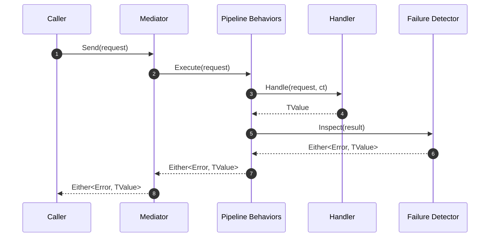

# SimpleMediator


SimpleMediator is a lightweight mediator abstraction for .NET applications that lean on functional programming principles. It keeps request and response contracts explicit, integrates naturally with [LanguageExt](https://github.com/louthy/language-ext), and embraces pipeline behaviors so cross-cutting concerns stay composable.

> ℹ️ Repository layout
>
> - `src/SimpleMediator` – library source code and packaging assets.
> - `tests/*` – unit, property, and contract test suites.
> - `benchmarks/*` – BenchmarkDotNet harness.
> - `docs/` – architecture notes, RFCs, and policies.

## Table of Contents

- [Why SimpleMediator](#why-simplemediator)
- [Quick Start](#quick-start)
- [Request Lifecycle](#request-lifecycle)
- [Handlers and Contracts](#handlers-and-contracts)
- [Pipeline Behaviors](#pipeline-behaviors)
- [Functional Failure Detection](#functional-failure-detection)
- [Diagnostics and Metrics](#diagnostics-and-metrics)
- [Configuration Reference](#configuration-reference)
- [Testing](#testing)
- [FAQ](#faq)
- [Future Work](#future-work)
- [License](#license)

## Why SimpleMediator

- Built for functional error handling with `Either` and `Option` from LanguageExt, backed by the mediator's `Error` wrapper for rich metadata.
- Lightweight dependency footprint: `LanguageExt.Core` and `Microsoft.Extensions.*` abstractions.
- Pipelines, pre-processors, and post-processors make cross-cutting concerns pluggable.
- Provides telemetry hooks (logging, metrics, activity tracing) without coupling to specific vendors.
- Ships with guardrails such as functional failure detection to keep domain invariants explicit.
- En ruta hacia una política Zero Exceptions para que los fallos operativos fluyan mediante Railway Oriented Programming (ROP) en lugar de excepciones.

## Zero Exceptions Initiative

SimpleMediator evoluciona hacia una política Zero Exceptions en la que las operaciones del mediador no propaguen excepciones en escenarios operativos habituales. El objetivo es que handlers, behaviors y el propio mediador comuniquen fallos mediante resultados funcionales (`Either<Error, TValue>`, `Option<T>`, etc.) manteniendo el flujo en los raíles del ROP. Durante la transición se registran los puntos que aún lanzan excepciones y se trabaja para encapsular esos errores dentro de los resultados funcionales, reservando las excepciones para situaciones realmente excepcionales. `MediatorErrors` ofrece fábricas predefinidas para encapsular excepciones dentro de `Error`.

## Quick Start

### 1. Reference the Package

Add the GitHub Packages feed once per environment:

```bash
dotnet nuget add source "https://nuget.pkg.github.com/dlrivada/index.json" \
    --name dlrivada-github \
    --username <your-gh-username> \
    --password <PAT-with-write-packages>
```

Then reference the package from your project:

```bash
dotnet add <YourProject>.csproj package SimpleMediator --version 0.1.0
```

### 2. Configure Dependency Injection

```csharp
using LanguageExt;
using Microsoft.Extensions.DependencyInjection;
using SimpleMediator;

var services = new ServiceCollection();

services.AddSimpleMediator(cfg =>
{
    cfg.RegisterServicesFromAssemblyContaining<ApplicationAssemblyMarker>()
       .AddPipelineBehavior(typeof(CommandActivityPipelineBehavior<,>))
       .AddPipelineBehavior(typeof(QueryActivityPipelineBehavior<,>))
       .AddPipelineBehavior(typeof(CommandMetricsPipelineBehavior<,>))
       .AddPipelineBehavior(typeof(QueryMetricsPipelineBehavior<,>));
});

services.AddSingleton<IFunctionalFailureDetector, AppFunctionalFailureDetector>();

await using var provider = services.BuildServiceProvider();
var mediator = provider.GetRequiredService<IMediator>();
```

### 3. Send a Command

```csharp
using LanguageExt;
using static LanguageExt.Prelude;

public sealed record RegisterUser(string Email, string Password) : ICommand<Unit>;

public sealed class RegisterUserHandler : ICommandHandler<RegisterUser, Unit>
{
    public async Task<Unit> Handle(RegisterUser command, CancellationToken ct)
    {
        var hashed = await Hashing.HashPassword(command.Password, ct).ConfigureAwait(false);
        await Users.StoreAsync(command.Email, hashed, ct).ConfigureAwait(false);
        return Unit.Default;
    }
}

var result = await mediator.Send(new RegisterUser("user@example.com", "Pass@123"), cancellationToken);

result.Match(
    Left: error => Console.WriteLine($"Registration failed: {error.GetMediatorCode()}"),
    Right: _ => Console.WriteLine("User registered"));
```

### 4. Query Data

```csharp
public sealed record GetUserProfile(string Email) : IQuery<UserProfile>;

public sealed class GetUserProfileHandler : IQueryHandler<GetUserProfile, UserProfile>
{
    public Task<UserProfile> Handle(GetUserProfile query, CancellationToken ct)
        => Users.FindAsync(query.Email, ct);
}

var profileResult = await mediator.Send(new GetUserProfile("user@example.com"), cancellationToken);

profileResult.Match(
    Left: error => Console.WriteLine($"Lookup failed: {error.Message}"),
    Right: profile => Console.WriteLine(profile.DisplayName));
```

## Request Lifecycle



## Handlers and Contracts

SimpleMediator relies on explicit interfaces and result types so each operation documents its intent.

| Contract | Purpose | Default Expectations |
| --- | --- | --- |
| `ICommand<TResult>` | Mutation or side effect returning `TResult`. | Handler returns `TResult`; mediator lifts to `Either<Error, TResult>`. |
| `IQuery<TResult>` | Read operation returning `TResult`. | Handler returns `TResult`; mediator lifts to `Either<Error, TResult>`. |
| `INotification` | Fire-and-forget signals. | Zero or more notification handlers. |

```csharp
public sealed record SendWelcomeEmail(string Email) : INotification;

public sealed class SendWelcomeEmailHandler : INotificationHandler<SendWelcomeEmail>
{
    public Task Handle(SendWelcomeEmail notification, CancellationToken ct)
        => EmailGateway.SendAsync(notification.Email, ct);
}

var publishResult = await mediator.Publish(new SendWelcomeEmail("user@example.com"), cancellationToken);

publishResult.Match(
    Left: error => Console.WriteLine($"Notification failed: {error.Message}"),
    Right: _ => Console.WriteLine("Welcome email dispatched"));
```

## Pipeline Behaviors

Pipeline behaviors wrap handler execution so concerns such as logging, validation, and retries stay isolated. Behaviors are executed in the order they are registered.

```csharp
services.AddSimpleMediator(cfg =>
{
    cfg.AddPipelineBehavior(typeof(ActivityPipelineBehavior<,>))
       .AddPipelineBehavior(typeof(ValidationPipelineBehavior<,>))
       .AddRequestPreProcessor(typeof(NormalizeWhitespacePreProcessor<>))
       .AddRequestPostProcessor(typeof(AuditTrailPostProcessor<,>));
}, typeof(ApplicationAssemblyMarker).Assembly);
```

### Built-in Behaviors

| Behavior | Responsibility |
| --- | --- |
| `CommandActivityPipelineBehavior<,>` | Creates OpenTelemetry `Activity` scopes for commands and annotates functional failures. |
| `QueryActivityPipelineBehavior<,>` | Emits tracing spans for queries and records failure metadata. |
| `CommandMetricsPipelineBehavior<,>` | Updates mediator counters/histograms after each command. |
| `QueryMetricsPipelineBehavior<,>` | Tracks success/failure metrics for queries, including functional errors. |

### Custom Behavior Example

```csharp
using LanguageExt;

public sealed class TimeoutPipelineBehavior<TRequest, TResponse> : IPipelineBehavior<TRequest, TResponse>
    where TRequest : IRequest<TResponse>
{
    private static readonly TimeSpan DefaultTimeout = TimeSpan.FromSeconds(5);

    public async Task<Either<Error, TResponse>> Handle(
        TRequest request,
        CancellationToken cancellationToken,
        RequestHandlerDelegate<TResponse> next)
    {
        using var cts = CancellationTokenSource.CreateLinkedTokenSource(cancellationToken);
        cts.CancelAfter(DefaultTimeout);

        try
        {
            return await next().WaitAsync(cts.Token).ConfigureAwait(false);
        }
        catch (OperationCanceledException ex) when (cts.IsCancellationRequested)
        {
            return MediatorErrors.FromException("mediator.timeout", ex, $"Timeout ejecutando {typeof(TRequest).Name}.");
        }
    }
}

cfg.AddPipelineBehavior(typeof(TimeoutPipelineBehavior<,>));
```

## Functional Failure Detection

Functional failure detection inspects handler results to translate domain-specific error envelopes into consistent mediator failures.

```csharp
public sealed class AppFunctionalFailureDetector : IFunctionalFailureDetector
{
    public bool TryExtractFailure(object? response, out string reason, out object? error)
    {
        if (response is OperationResult result && !result.IsSuccess)
        {
            reason = result.Code ?? "operation.failed";
            error = result;
            return true;
        }

        reason = string.Empty;
        error = null;
        return false;
    }

    public string? TryGetErrorCode(object? error)
        => (error as OperationResult)?.Code;

    public string? TryGetErrorMessage(object? error)
        => (error as OperationResult)?.Message;
}

services.AddSingleton<IFunctionalFailureDetector, AppFunctionalFailureDetector>();
```

## Diagnostics and Metrics

- `MediatorDiagnostics` wires logging scopes and structured information for each request.
- `MediatorMetrics` exposes counters and histograms via `System.Diagnostics.Metrics`.
- `ActivityPipelineBehavior` integrates with `System.Diagnostics.ActivitySource` so OpenTelemetry exporters can pick up traces.

```csharp
services.AddOpenTelemetry()
    .WithTracing(b => b.AddSource("SimpleMediator"))
    .WithMetrics(b => b.AddMeter("SimpleMediator"));
```

## Configuration Reference

```csharp
services.AddSimpleMediator(cfg =>
{
    cfg.RegisterServicesFromAssemblyContaining<ApplicationAssemblyMarker>()
       .AddPipelineBehavior(typeof(CommandActivityPipelineBehavior<,>))
       .AddPipelineBehavior(typeof(QueryActivityPipelineBehavior<,>))
       .AddRequestPreProcessor(typeof(ValidationPreProcessor<>))
       .AddRequestPostProcessor(typeof(AuditTrailPostProcessor<,>))
       .WithHandlerLifetime(ServiceLifetime.Scoped);
});
```

| API | Description |
| --- | --- |
| `RegisterServicesFromAssembly(assembly)` | Adds one assembly to scan for handlers, notifications, and processors. |
| `RegisterServicesFromAssemblies(params Assembly[])` | Adds several assemblies at once, ignoring `null` entries. |
| `RegisterServicesFromAssemblyContaining<T>()` | Convenience helper that adds the assembly where `T` is defined. |
| `AddPipelineBehavior(Type)` | Registers a scoped pipeline behavior (open or closed generic). |
| `AddRequestPreProcessor(Type)` | Registers a scoped pre-processor executed before the handler. |
| `AddRequestPostProcessor(Type)` | Registers a scoped post-processor executed after the handler. |
| `WithHandlerLifetime(ServiceLifetime)` | Overrides the lifetime used for handlers discovered during scanning. |

## Testing

```bash
dotnet test SimpleMediator.slnx --configuration Release
```

To generate coverage (powered by `coverlet.collector`) and produce HTML/Text summaries locally:

```bash
dotnet test SimpleMediator.slnx --configuration Release --collect:"XPlat Code Coverage" --results-directory artifacts/test-results
dotnet tool restore
dotnet tool run reportgenerator -reports:"artifacts/test-results/**/coverage.cobertura.xml" -targetdir:"artifacts/coverage" -reporttypes:"Html;HtmlSummary;TextSummary"
```

The HTML dashboard (`artifacts/coverage/index.html`) and condensed summary (`artifacts/coverage/Summary.txt`) highlight hot spots—`SimpleMediator.SimpleMediator` now sits just above 90% line coverage after the latest hardening pass, so incremental gains hinge on rare cancellation/error permutations. The CI workflow runs the same commands and publishes the output as a downloadable artifact.

Mutation testing is exercised via Stryker.NET. Run the full sweep using the single-file helper (the same command the CI workflow executes):

```bash
dotnet run --file scripts/run-stryker.cs
```

Reports land in `StrykerOutput/<timestamp>/reports/` with HTML/JSON payloads. After a run, refresh the mutation badge and emit a concise summary by executing:

```bash
dotnet run --file scripts/update-mutation-summary.cs
```

The helper mirrors Stryker's scoring (compile errors are excluded from the denominator) and colors the badge according to configured thresholds. It edits `README.md` in place when the standard badge pattern is present and will simply print a suggested badge if the section has been customized.

Use `scripts/analyze-mutation-report.cs <filter>` to inspect survivors by file fragment when triaging regressions.

The suite exercises:

- Mediator orchestration across happy-path and exceptional flows.
- Command/query telemetry behaviors (activities, metrics, cancellation, functional failures).
- Service registration helpers and configuration guards.
- Default implementations such as `MediatorMetrics` and the null functional failure detector.

### Load Harnesses

Two load harnesses validate sustained throughput and resource envelopes:

```bash
dotnet run --file scripts/run-load-harness.cs -- --duration 00:01:00 --send-workers 8 --publish-workers 4
dotnet run --file scripts/run-load-harness.cs -- --nbomber send-burst --duration 00:00:30
```

- The console harness targets `load/SimpleMediator.LoadTests` and pairs with `scripts/collect-load-metrics.cs` to capture CPU/memory samples (`harness-<timestamp>.log`, `metrics-<timestamp>.csv`).
- NBomber scenarios live in `load/SimpleMediator.NBomber` with JSON profiles under `load/profiles/`. The summarizer `scripts/summarize-nbomber-run.cs -- --thresholds ci/nbomber-thresholds.json` prints throughput/latency stats and fails when send-burst throughput dips below 6.75M ops/sec or latency rises above 0.85 ms.
- CI enforces guardrails via `scripts/check-load-metrics.cs -- --config ci/load-thresholds.json` for the console harness and the summarizer for NBomber; both pipelines publish artifacts in `artifacts/load-metrics/` and feed `scripts/aggregate-performance-history.cs` to refresh `docs/data/load-history.md`.

## Quality Checklist

- Coverage ≥90% line: `dotnet test SimpleMediator.slnx --configuration Release` followed by `reportgenerator` (see `docs/en/guides/TESTING.md`).
- Mutation score ≥93.74%: `dotnet run --file scripts/run-stryker.cs` then `dotnet run --file scripts/update-mutation-summary.cs` to refresh badges.
- Benchmarks within guardrails: `dotnet run --file scripts/run-benchmarks.cs` and `dotnet run --file scripts/check-benchmarks.cs`.
- Load guardrails: console (`dotnet run --file scripts/check-load-metrics.cs -- --config ci/load-thresholds.json`), NBomber (`dotnet run --file scripts/summarize-nbomber-run.cs -- --thresholds ci/nbomber-thresholds.json`).
- Requirements documentation current: update `docs/en/guides/REQUIREMENTS.md` and `docs/en/guides/REQUIREMENTS_MAPPING.md` when adding scenarios or gates.

## FAQ

- **Does SimpleMediator replace MediatR?** It takes inspiration from MediatR but focuses on functional result types and richer telemetry hooks.
- **Can I use it without LanguageExt?** Handlers rely on `Either` and `Unit` from LanguageExt; alternative abstractions would require custom adapters.
- **How do I handle retries?** Wrap logic inside a custom pipeline behavior or delegate to Polly policies executed inside the handler.
- **Is streaming supported?** Streaming notifications are supported via processors that work with `IAsyncEnumerable` payloads.

## Future Work

- Contravariant handler resolution to reduce duplication when commands share interfaces.
- Additional first-party behaviors (idempotency, Polly-based retries) for common patterns.
- Templates for publishing to internal feeds (GitHub Packages, Azure Artifacts) with automated semantic versioning.

## License

This repository is distributed under a private license. See `LICENSE` for details.
