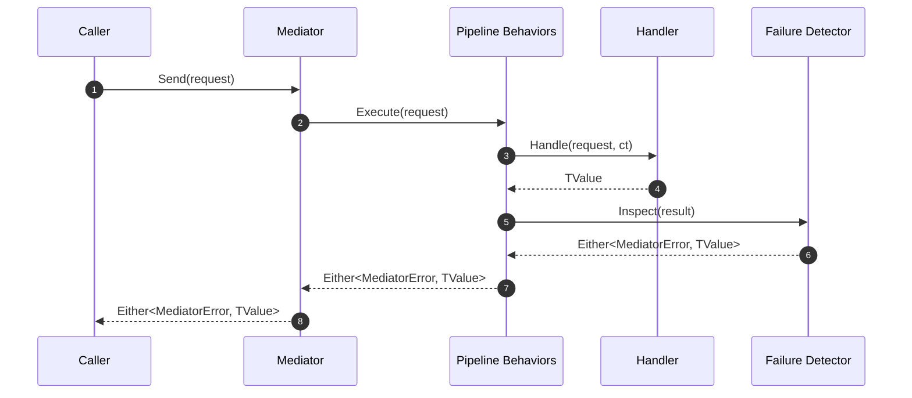

# SimpleMediator

[](https://github.com/dlrivada/SimpleMediator/actions/workflows/dotnet-ci.yml)
[](https://github.com/dlrivada/SimpleMediator/actions/workflows/sonarcloud.yml)
[](https://sonarcloud.io/summary/new_code?id=dlrivada_SimpleMediator)
[](https://github.com/dlrivada/SimpleMediator/actions/workflows/codeql.yml)
[](https://github.com/dlrivada/SimpleMediator/actions/workflows/sbom.yml)
[](https://github.com/dlrivada/SimpleMediator/actions/workflows/benchmarks.yml)
[](https://docs.github.com/code-security/dependabot)
[](https://www.conventionalcommits.org/)


[](https://sonarcloud.io/summary/new_code?id=dlrivada_SimpleMediator)
[](https://sonarcloud.io/summary/new_code?id=dlrivada_SimpleMediator)
[](https://sonarcloud.io/summary/new_code?id=dlrivada_SimpleMediator)
[](https://sonarcloud.io/summary/new_code?id=dlrivada_SimpleMediator)
[](https://sonarcloud.io/summary/new_code?id=dlrivada_SimpleMediator)
[](https://sonarcloud.io/summary/new_code?id=dlrivada_SimpleMediator)
[](https://sonarcloud.io/summary/new_code?id=dlrivada_SimpleMediator)


SimpleMediator is a lightweight mediator abstraction for .NET applications that lean on functional programming principles. It keeps request and response contracts explicit, integrates naturally with [LanguageExt](https://github.com/louthy/language-ext), and embraces pipeline behaviors so cross-cutting concerns stay composable.

> ℹ️ Repository layout
>
> - `src/SimpleMediator` – library source code and packaging assets.
> - `tests/*` – unit, property, and contract test suites.
> - `benchmarks/*` – BenchmarkDotNet harness.
> - `docs/` – architecture notes, RFCs, and policies.

## Table of Contents

- [Why SimpleMediator](#why-simplemediator)
- [Capabilities](#capabilities)
- [Quick Start](#quick-start)
- [Request Lifecycle](#request-lifecycle)
- [Handlers and Contracts](#handlers-and-contracts)
- [Pipeline Behaviors](#pipeline-behaviors)
- [Functional Failure Detection](#functional-failure-detection)
- [Diagnostics and Metrics](#diagnostics-and-metrics)
- [Error Metadata](#error-metadata)
- [Configuration Reference](#configuration-reference)
- [Testing](#testing)
- [Quality Checklist](#quality-checklist)
- [Quality & Security Roadmap](#quality--security-roadmap)
- [FAQ](#faq)
- [Future Work](#future-work)
- [License](#license)

## Why SimpleMediator

- Built for functional error handling with `Either` and `Option` from LanguageExt, backed by the mediator's `MediatorError` wrapper for rich metadata.
- Lightweight dependency footprint: `LanguageExt.Core` and `Microsoft.Extensions.*` abstractions.
- Pipelines, pre-processors, and post-processors make cross-cutting concerns pluggable.
- Provides telemetry hooks (logging, metrics, activity tracing) without coupling to specific vendors.
- Ships with guardrails such as functional failure detection to keep domain invariants explicit.
- On track for a Zero Exceptions policy so operational failures travel through Railway Oriented Programming (ROP) patterns instead of bubbling up as exceptions.

## Capabilities

SimpleMediator takes cues from MediatR, Kommand, and Wolverine, but positions itself as a functional, observable application pipeline for CQRS-style work.

- **Messaging model:** Commands, queries, and notifications with explicit contracts; `Send`/`Publish` return `ValueTask<Either<MediatorError, TValue>>` to keep async overhead low and failures explicit.
- **Pipeline composition:** Ordered behaviors plus request pre/post processors to layer validation, retries, timeouts, audits, and tracing without touching handlers; works with open or closed generics.
- **Discovery & DI integration:** Assembly scanning for handlers, notifications, behaviors, and processors; configurable handler lifetimes; legacy aliases (`AddApplicationMessaging`) for drop-in adoption; caches avoid repeated reflection.
- **Observability first:** Built-in logging scopes and `ActivitySource` spans, metrics via `IMediatorMetrics` counters/histograms, and OTEL-ready defaults for traces and metrics.
- **Functional failure handling:** `IFunctionalFailureDetector` lets you translate domain envelopes into `MediatorError` with consistent codes/messages; ships with a null detector for opt-in mapping.
- **Notification fan-out:** Publishes to zero or many handlers with per-handler error logging, cancellation awareness, and functional results instead of exceptions.
- **Quality & reliability toolchain:** Benchmarks, load harnesses, mutation testing, and coverage guardrails are baked into the repo to keep regressions visible.

### Feature matrix

| Área | Qué incluye | Dónde empezar |
| --- | --- | --- |
| Contratos CQRS | `ICommand`/`IQuery`/`INotification`, handlers y callbacks explícitos; resultados funcionales (`Either`, `Unit`). | [Handlers and Contracts](#handlers-and-contracts) |
| Pipeline y cross-cutting | Behaviors ordenados, pre/post processors, soporta genéricos abiertos/cerrados y timeouts/reintentos vía behaviors personalizados. | [Pipeline Behaviors](#pipeline-behaviors) |
| Observabilidad | `MediatorDiagnostics` (logging + ActivitySource), `IMediatorMetrics` (counters/histogram), behaviors de métricas y trazas listos para OTEL. | [Diagnostics and Metrics](#diagnostics-and-metrics) |
| Gestión de errores | `MediatorError`, iniciativa Zero Exceptions, `IFunctionalFailureDetector` para mapear envelopes de dominio a códigos consistentes. | [Zero Exceptions Initiative](#zero-exceptions-initiative) y [Functional Failure Detection](#functional-failure-detection) |
| Descubrimiento y DI | Escaneo de ensamblados, registro de handlers/behaviors/processors, control de lifetimes, alias `AddApplicationMessaging`. | [Configuration Reference](#configuration-reference) |
| Notificaciones | Fan-out con múltiples handlers, registro de fallos por handler, cancelación y resultados funcionales en lugar de excepciones. | [Handlers and Contracts](#handlers-and-contracts) |
| Calidad continua | Benchmarks, NBomber, Stryker, cobertura, umbrales en CI con scripts de apoyo y badges. | [Quality Checklist](#quality-checklist) |

### Dónde leer código rápidamente

- Mediador y contratos: [`SimpleMediator.cs`](https://github.com/dlrivada/SimpleMediator/blob/main/src/SimpleMediator/SimpleMediator.cs), [`IMediator.cs`](https://github.com/dlrivada/SimpleMediator/blob/main/src/SimpleMediator/IMediator.cs), [`IRequest.cs`](https://github.com/dlrivada/SimpleMediator/blob/main/src/SimpleMediator/IRequest.cs), [`INotification.cs`](https://github.com/dlrivada/SimpleMediator/blob/main/src/SimpleMediator/INotification.cs).
- Registro y escaneo: [`ServiceCollectionExtensions.cs`](https://github.com/dlrivada/SimpleMediator/blob/main/src/SimpleMediator/ServiceCollectionExtensions.cs), [`MediatorAssemblyScanner.cs`](https://github.com/dlrivada/SimpleMediator/blob/main/src/SimpleMediator/MediatorAssemblyScanner.cs).
- Pipelines y callbacks: [`IPipelineBehavior.cs`](https://github.com/dlrivada/SimpleMediator/blob/main/src/SimpleMediator/IPipelineBehavior.cs), [`IRequestPreProcessor.cs`](https://github.com/dlrivada/SimpleMediator/blob/main/src/SimpleMediator/IRequestPreProcessor.cs), [`IRequestPostProcessor.cs`](https://github.com/dlrivada/SimpleMediator/blob/main/src/SimpleMediator/IRequestPostProcessor.cs), behaviors en [`Behaviors/`](https://github.com/dlrivada/SimpleMediator/tree/main/src/SimpleMediator/Behaviors).
- Observabilidad y métricas: [`MediatorDiagnostics.cs`](https://github.com/dlrivada/SimpleMediator/blob/main/src/SimpleMediator/MediatorDiagnostics.cs), [`MediatorMetrics.cs`](https://github.com/dlrivada/SimpleMediator/blob/main/src/SimpleMediator/MediatorMetrics.cs).
- Errores y ROP: [`MediatorError.cs`](https://github.com/dlrivada/SimpleMediator/blob/main/src/SimpleMediator/MediatorError.cs), [`MediatorResult.cs`](https://github.com/dlrivada/SimpleMediator/blob/main/src/SimpleMediator/MediatorResult.cs), [`IFunctionalFailureDetector.cs`](https://github.com/dlrivada/SimpleMediator/blob/main/src/SimpleMediator/IFunctionalFailureDetector.cs), [`NullFunctionalFailureDetector.cs`](https://github.com/dlrivada/SimpleMediator/blob/main/src/SimpleMediator/NullFunctionalFailureDetector.cs).

### Snippets rápidos

#### Enviar comando (ROP sobre Either)

```csharp
var result = await mediator.Send(new RegisterUser("user@example.com", "Pass@123"), ct);

result.Match(
    Left: err => logger.LogWarning("Registration failed {Code}", err.GetMediatorCode()),
    Right: _ => logger.LogInformation("User registered"));
```

#### Publicar notificación fan-out

```csharp
await mediator.Publish(new SendWelcomeEmail("user@example.com"), ct);
// Handlers run independently; failures surface as MediatorError instead of exceptions.
```

#### Behavior personalizado (timeout)

```csharp
public sealed class TimeoutBehavior<TReq, TRes> : IPipelineBehavior<TReq, TRes>
    where TReq : IRequest<TRes>
{
    public async ValueTask<Either<MediatorError, TRes>> Handle(
        TReq request,
        RequestHandlerCallback<TRes> next,
        CancellationToken ct)
    {
        using var cts = CancellationTokenSource.CreateLinkedTokenSource(ct);
        cts.CancelAfter(TimeSpan.FromSeconds(5));
        try { return await next().WaitAsync(cts.Token).ConfigureAwait(false); }
        catch (OperationCanceledException ex) when (cts.IsCancellationRequested)
        { return MediatorErrors.FromException("mediator.timeout", ex, "Timed out"); }
    }
}
```

#### Detección de fallos funcionales

```csharp
public sealed class AppFailureDetector : IFunctionalFailureDetector
{
    public bool TryExtractFailure(object? response, out string reason, out object? error)
    {
        if (response is OperationResult r && !r.IsSuccess)
        { reason = r.Code ?? "operation.failed"; error = r; return true; }
        reason = string.Empty; error = null; return false;
    }

    public string? TryGetErrorCode(object? error) => (error as OperationResult)?.Code;
    public string? TryGetErrorMessage(object? error) => (error as OperationResult)?.Message;
}
```

#### Registro en DI con behaviors

```csharp
services.AddSimpleMediator(cfg =>
{
    cfg.RegisterServicesFromAssemblyContaining<ApplicationAssemblyMarker>()
       .AddPipelineBehavior(typeof(TimeoutBehavior<,>))
       .AddPipelineBehavior(typeof(CommandMetricsPipelineBehavior<,>))
       .AddPipelineBehavior(typeof(QueryActivityPipelineBehavior<,>));
});

services.AddSingleton<IFunctionalFailureDetector, AppFailureDetector>();
```

## Zero Exceptions Initiative

SimpleMediator is evolving toward a Zero Exceptions policy, where mediator operations stop throwing in expected operational scenarios. Handlers, behaviors, and the mediator itself report failures through functional results (`Either<MediatorError, TValue>`, `Option<T>`, etc.), keeping execution on the ROP rails. During the transition we track remaining throw sites and wrap them in functional results, reserving exceptions for truly exceptional failures. `MediatorErrors` exposes factory helpers to encapsulate exceptions inside `MediatorError` instances.

## Quick Start

### 1. Reference the Package

Add the GitHub Packages feed once per environment:

```bash
dotnet nuget add source "https://nuget.pkg.github.com/dlrivada/index.json" \
    --name dlrivada-github \
    --username <your-gh-username> \
    --password <PAT-with-write-packages>
```

Then reference the package from your project:

```bash
dotnet add <YourProject>.csproj package SimpleMediator --version 0.1.0
```

### 2. Configure Dependency Injection

```csharp
using LanguageExt;
using Microsoft.Extensions.DependencyInjection;
using SimpleMediator;

var services = new ServiceCollection();

services.AddSimpleMediator(cfg =>
{
    cfg.RegisterServicesFromAssemblyContaining<ApplicationAssemblyMarker>()
       .AddPipelineBehavior(typeof(CommandActivityPipelineBehavior<,>))
       .AddPipelineBehavior(typeof(QueryActivityPipelineBehavior<,>))
       .AddPipelineBehavior(typeof(CommandMetricsPipelineBehavior<,>))
       .AddPipelineBehavior(typeof(QueryMetricsPipelineBehavior<,>));
});

services.AddSingleton<IFunctionalFailureDetector, AppFunctionalFailureDetector>();

await using var provider = services.BuildServiceProvider();
var mediator = provider.GetRequiredService<IMediator>();
```

### 3. Send a Command

```csharp
using LanguageExt;
using static LanguageExt.Prelude;

public sealed record RegisterUser(string Email, string Password) : ICommand<Unit>;

public sealed class RegisterUserHandler : ICommandHandler<RegisterUser, Unit>
{
    public async Task<Unit> Handle(RegisterUser command, CancellationToken ct)
    {
        var hashed = await Hashing.HashPassword(command.Password, ct).ConfigureAwait(false);
        await Users.StoreAsync(command.Email, hashed, ct).ConfigureAwait(false);
        return Unit.Default;
    }
}

var result = await mediator.Send(new RegisterUser("user@example.com", "Pass@123"), cancellationToken);

result.Match(
    Left: error => Console.WriteLine($"Registration failed: {error.GetMediatorCode()}"),
    Right: _ => Console.WriteLine("User registered"));
```

### 4. Query Data

```csharp
public sealed record GetUserProfile(string Email) : IQuery<UserProfile>;

public sealed class GetUserProfileHandler : IQueryHandler<GetUserProfile, UserProfile>
{
    public Task<UserProfile> Handle(GetUserProfile query, CancellationToken ct)
        => Users.FindAsync(query.Email, ct);
}

var profileResult = await mediator.Send(new GetUserProfile("user@example.com"), cancellationToken);

profileResult.Match(
    Left: error => Console.WriteLine($"Lookup failed: {error.Message}"),
    Right: profile => Console.WriteLine(profile.DisplayName));
```

## Request Lifecycle



## Handlers and Contracts

SimpleMediator relies on explicit interfaces and result types so each operation documents its intent.

| Contract | Purpose | Default Expectations |
| --- | --- | --- |
| `ICommand<TResult>` | Mutation or side effect returning `TResult`. | Handler returns `TResult`; mediator lifts to `Either<MediatorError, TResult>`. |
| `IQuery<TResult>` | Read operation returning `TResult`. | Handler returns `TResult`; mediator lifts to `Either<MediatorError, TResult>`. |
| `INotification` | Fire-and-forget signals. | Zero or more notification handlers. |

```csharp
public sealed record SendWelcomeEmail(string Email) : INotification;

public sealed class SendWelcomeEmailHandler : INotificationHandler<SendWelcomeEmail>
{
    public Task Handle(SendWelcomeEmail notification, CancellationToken ct)
        => EmailGateway.SendAsync(notification.Email, ct);
}

var publishResult = await mediator.Publish(new SendWelcomeEmail("user@example.com"), cancellationToken);

publishResult.Match(
    Left: error => Console.WriteLine($"Notification failed: {error.Message}"),
    Right: _ => Console.WriteLine("Welcome email dispatched"));
```

## Pipeline Behaviors

Pipeline behaviors wrap handler execution so concerns such as logging, validation, and retries stay isolated. Behaviors are executed in the order they are registered.

```csharp
services.AddSimpleMediator(cfg =>
{
    cfg.AddPipelineBehavior(typeof(ActivityPipelineBehavior<,>))
       .AddPipelineBehavior(typeof(ValidationPipelineBehavior<,>))
       .AddRequestPreProcessor(typeof(NormalizeWhitespacePreProcessor<>))
       .AddRequestPostProcessor(typeof(AuditTrailPostProcessor<,>));
}, typeof(ApplicationAssemblyMarker).Assembly);
```

### Built-in Behaviors

| Behavior | Responsibility |
| --- | --- |
| `CommandActivityPipelineBehavior<,>` | Creates OpenTelemetry `Activity` scopes for commands and annotates functional failures. |
| `QueryActivityPipelineBehavior<,>` | Emits tracing spans for queries and records failure metadata. |
| `CommandMetricsPipelineBehavior<,>` | Updates mediator counters/histograms after each command. |
| `QueryMetricsPipelineBehavior<,>` | Tracks success/failure metrics for queries, including functional errors. |

### Custom Behavior Example

```csharp
using LanguageExt;

public sealed class TimeoutPipelineBehavior<TRequest, TResponse> : IPipelineBehavior<TRequest, TResponse>
    where TRequest : IRequest<TResponse>
{
    private static readonly TimeSpan DefaultTimeout = TimeSpan.FromSeconds(5);

    public async ValueTask<Either<MediatorError, TResponse>> Handle(
        TRequest request,
        RequestHandlerCallback<TResponse> nextStep,
        CancellationToken cancellationToken)
    {
        using var cts = CancellationTokenSource.CreateLinkedTokenSource(cancellationToken);
        cts.CancelAfter(DefaultTimeout);

        try
        {
            return await nextStep().WaitAsync(cts.Token).ConfigureAwait(false);
        }
        catch (OperationCanceledException ex) when (cts.IsCancellationRequested)
        {
            return MediatorErrors.FromException("mediator.timeout", ex, $"Timeout while running {typeof(TRequest).Name}.");
        }
    }
}

cfg.AddPipelineBehavior(typeof(TimeoutPipelineBehavior<,>));
```

## Functional Failure Detection

Functional failure detection inspects handler results to translate domain-specific error envelopes into consistent mediator failures.

```csharp
public sealed class AppFunctionalFailureDetector : IFunctionalFailureDetector
{
    public bool TryExtractFailure(object? response, out string reason, out object? error)
    {
        if (response is OperationResult result && !result.IsSuccess)
        {
            reason = result.Code ?? "operation.failed";
            error = result;
            return true;
        }

        reason = string.Empty;
        error = null;
        return false;
    }

    public string? TryGetErrorCode(object? error)
        => (error as OperationResult)?.Code;

    public string? TryGetErrorMessage(object? error)
        => (error as OperationResult)?.Message;
}

services.AddSingleton<IFunctionalFailureDetector, AppFunctionalFailureDetector>();
```

## Diagnostics and Metrics

- `MediatorDiagnostics` wires logging scopes and structured information for each request.
- `MediatorMetrics` exposes counters and histograms via `System.Diagnostics.Metrics`.
- `ActivityPipelineBehavior` integrates with `System.Diagnostics.ActivitySource` so OpenTelemetry exporters can pick up traces.

```csharp
services.AddOpenTelemetry()
    .WithTracing(b => b.AddSource("SimpleMediator"))
    .WithMetrics(b => b.AddMeter("SimpleMediator"));
```

## Error Metadata

`MediatorError` retains an internal `MetadataException` whose immutable metadata can be retrieved via `GetMediatorMetadata()`. Keys are consistent across the pipeline to aid diagnostics:

- `handler`: fully qualified handler type when available.
- `request` / `notification`: type involved in the failure.
- `expectedNotification`: type expected when `Handle` is missing.
- `stage`: pipeline stage (`handler`, `behavior`, `preprocessor`, `postprocessor`, `invoke`, `execute`).
- `behavior` / `preProcessor` / `postProcessor`: fully qualified type names for cross-cutting components.
- `returnType`: handler return type when the `Handle` signature is invalid.

Usage example:

```csharp
var outcome = await mediator.Send(new DoSomething(), ct);

outcome.Match(
    Left: err =>
    {
        var metadata = err.GetMediatorMetadata();
        var code = err.GetMediatorCode();
        logger.LogWarning("Failure {Code} at {Stage} by {Handler}",
            code,
            metadata.TryGetValue("stage", out var stage) ? stage : "unknown",
            metadata.TryGetValue("handler", out var handler) ? handler : "unknown");
    },
    Right: _ => { /* success */ });
```

## Configuration Reference

```csharp
services.AddSimpleMediator(cfg =>
{
    cfg.RegisterServicesFromAssemblyContaining<ApplicationAssemblyMarker>()
       .AddPipelineBehavior(typeof(CommandActivityPipelineBehavior<,>))
       .AddPipelineBehavior(typeof(QueryActivityPipelineBehavior<,>))
       .AddRequestPreProcessor(typeof(ValidationPreProcessor<>))
       .AddRequestPostProcessor(typeof(AuditTrailPostProcessor<,>))
       .WithHandlerLifetime(ServiceLifetime.Scoped);
});
```

| API | Description |
| --- | --- |
| `RegisterServicesFromAssembly(assembly)` | Adds one assembly to scan for handlers, notifications, and processors. |
| `RegisterServicesFromAssemblies(params Assembly[])` | Adds several assemblies at once, ignoring `null` entries. |
| `RegisterServicesFromAssemblyContaining<T>()` | Convenience helper that adds the assembly where `T` is defined. |
| `AddPipelineBehavior(Type)` | Registers a scoped pipeline behavior (open or closed generic). |
| `AddRequestPreProcessor(Type)` | Registers a scoped pre-processor executed before the handler. |
| `AddRequestPostProcessor(Type)` | Registers a scoped post-processor executed after the handler. |
| `WithHandlerLifetime(ServiceLifetime)` | Overrides the lifetime used for handlers discovered during scanning. |

## Testing

```bash
dotnet test SimpleMediator.slnx --configuration Release
```

To generate coverage (powered by `coverlet.collector`) and produce HTML/Text summaries locally:

```bash
dotnet test SimpleMediator.slnx --configuration Release --collect:"XPlat Code Coverage" --results-directory artifacts/test-results
dotnet tool restore
dotnet tool run reportgenerator -reports:"artifacts/test-results/**/coverage.cobertura.xml" -targetdir:"artifacts/coverage" -reporttypes:"Html;HtmlSummary;TextSummary"
```

The HTML dashboard (`artifacts/coverage/index.html`) and condensed summary (`artifacts/coverage/Summary.txt`) highlight hot spots—`SimpleMediator.SimpleMediator` now sits just above 90% line coverage after the latest hardening pass, so incremental gains hinge on rare cancellation/error permutations. The CI workflow runs the same commands and publishes the output as a downloadable artifact.

Mutation testing is exercised via Stryker.NET. Run the full sweep using the single-file helper (the same command the CI workflow executes):

```bash
dotnet run --file scripts/run-stryker.cs
```

Reports land in `StrykerOutput/<timestamp>/reports/` with HTML/JSON payloads. After a run, refresh the mutation badge and emit a concise summary by executing:

```bash
dotnet run --file scripts/update-mutation-summary.cs
```

The helper mirrors Stryker's scoring (compile errors are excluded from the denominator) and colors the badge according to configured thresholds. It edits `README.md` in place when the standard badge pattern is present and will simply print a suggested badge if the section has been customized.

Use `scripts/analyze-mutation-report.cs <filter>` to inspect survivors by file fragment when triaging regressions.

The suite exercises:

- Mediator orchestration across happy-path and exceptional flows.
- Command/query telemetry behaviors (activities, metrics, cancellation, functional failures).
- Service registration helpers and configuration guards.
- Default implementations such as `MediatorMetrics` and the null functional failure detector.

### Load Harnesses

Two load harnesses validate sustained throughput and resource envelopes:

```bash
dotnet run --file scripts/run-load-harness.cs -- --duration 00:01:00 --send-workers 8 --publish-workers 4
dotnet run --file scripts/run-load-harness.cs -- --nbomber send-burst --duration 00:00:30
```

- The console harness targets `load/SimpleMediator.LoadTests` and pairs with `scripts/collect-load-metrics.cs` to capture CPU/memory samples (`harness-<timestamp>.log`, `metrics-<timestamp>.csv`).
- NBomber scenarios live in `load/SimpleMediator.NBomber` with JSON profiles under `load/profiles/`. The summarizer `scripts/summarize-nbomber-run.cs -- --thresholds ci/nbomber-thresholds.json` prints throughput/latency stats and fails when send-burst throughput dips below 6.75M ops/sec or latency rises above 0.85 ms.
- CI enforces guardrails via `scripts/check-load-metrics.cs -- --config ci/load-thresholds.json` for the console harness and the summarizer for NBomber; both pipelines publish artifacts in `artifacts/load-metrics/` and feed `scripts/aggregate-performance-history.cs` to refresh `docs/data/load-history.md`.

## Quality Checklist

- Coverage ≥90% line: `dotnet test SimpleMediator.slnx --configuration Release` followed by `reportgenerator` (see `docs/en/guides/TESTING.md`).
- Mutation score ≥93.74%: `dotnet run --file scripts/run-stryker.cs` then `dotnet run --file scripts/update-mutation-summary.cs` to refresh badges.
- Benchmarks within guardrails: `dotnet run --file scripts/run-benchmarks.cs` and `dotnet run --file scripts/check-benchmarks.cs`.
- Thresholds live in `ci/benchmark-thresholds.json`; update them only after capturing a new baseline on CI.
- Load guardrails: console (`dotnet run --file scripts/check-load-metrics.cs -- --config ci/load-thresholds.json`), NBomber (`dotnet run --file scripts/summarize-nbomber-run.cs -- --thresholds ci/nbomber-thresholds.json`).
- Requirements documentation current: update `docs/en/guides/REQUIREMENTS.md` and `docs/en/guides/REQUIREMENTS_MAPPING.md` when adding scenarios or gates.

## Quality & Security Roadmap

The living roadmap in `QUALITY_SECURITY_ROADMAP.md` complements this README with quantified objectives, badge inventory, and an incremental plan covering immediate, short, medium, and long-term quality efforts. Highlights:

- **Objectives:** analyzer clean builds, ≥95 % branch coverage on critical packages, guarded benchmarks, and SBOM currency for each release.
- **Automation:** dedicated workflows (`dotnet-ci.yml`, `codeql.yml`, `sbom.yml`, `benchmarks.yml`) keep formatting, analysis, dependency hygiene, and performance on autopilot.
- **Governance:** Dependabot, Conventional Commits, and release documentation combine to enforce predictable delivery.
- **Follow-up:** the roadmap checklist tracks pending tasks such as expanding regression tests, instrumenting metrics, and pursuing SLSA provenance.

## FAQ

- **Does SimpleMediator replace MediatR?** It takes inspiration from MediatR but focuses on functional result types and richer telemetry hooks.
- **Can I use it without LanguageExt?** Handlers rely on `Either` and `Unit` from LanguageExt; alternative abstractions would require custom adapters.
- **How do I handle retries?** Wrap logic inside a custom pipeline behavior or delegate to Polly policies executed inside the handler.
- **Is streaming supported?** Streaming notifications are supported via processors that work with `IAsyncEnumerable` payloads.
- **How do I log error metadata?** Use `GetMediatorCode()` for the canonical code and `GetMediatorMetadata()` for context (handler, stage, request/notification). Example:

    ```csharp
    var outcome = await mediator.Publish(notification, ct);
    outcome.Match(
            Left: err =>
            {
                    var meta = err.GetMediatorMetadata();
                    logger.LogError("{Code} at {Stage} by {Handler}",
                            err.GetMediatorCode(),
                            meta.TryGetValue("stage", out var stage) ? stage : "n/a",
                            meta.TryGetValue("handler", out var handler) ? handler : "n/a");
            },
            Right: _ => { });
    ```

## Future Work

- Contravariant handler resolution to reduce duplication when commands share interfaces.
- Additional first-party behaviors (idempotency, Polly-based retries) for common patterns.
- Templates for publishing to internal feeds (GitHub Packages, Azure Artifacts) with automated semantic versioning.

## License

This repository is distributed under a private license. See `LICENSE` for details.
