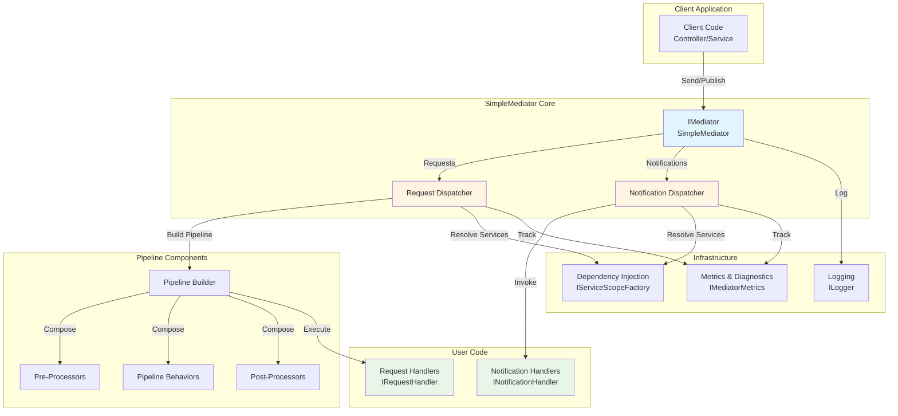
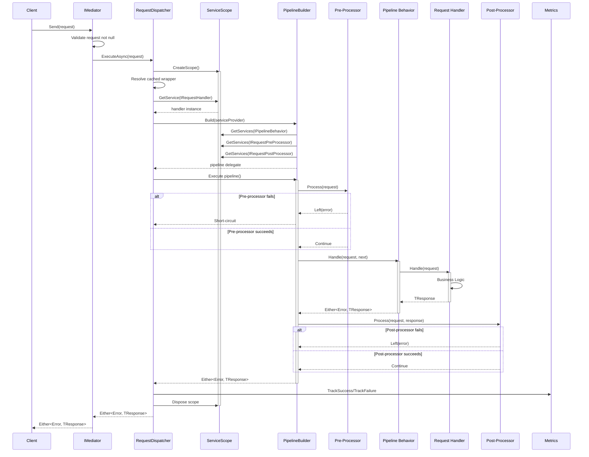
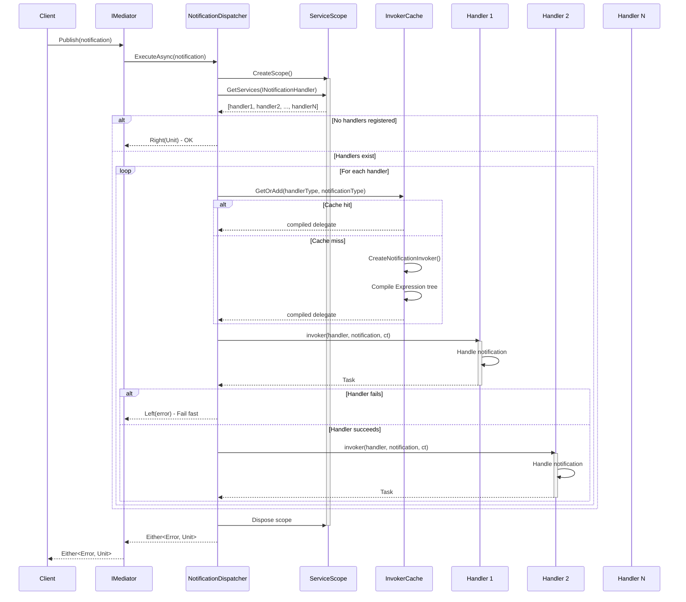
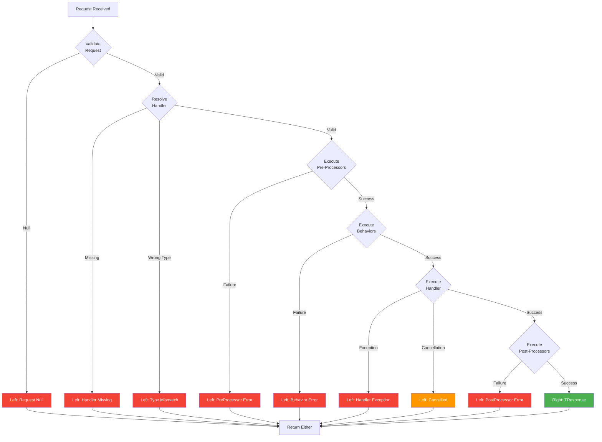
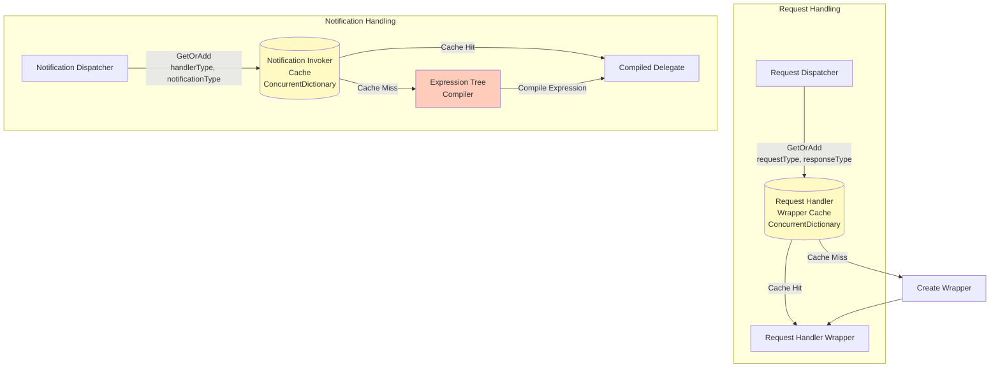
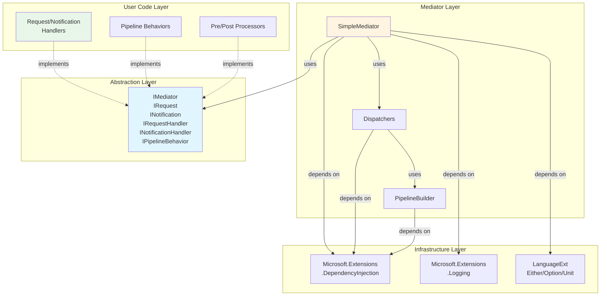

# SimpleMediator Component Diagram

This document provides architectural diagrams showing the structure and flow of SimpleMediator.

## High-Level Architecture

## Request Processing Flow

## Notification Broadcasting Flow

## Component Responsibilities

### Core Components

| Component | Responsibility | Lifetime |
|-----------|---------------|----------|
| **SimpleMediator** | Entry point, validation, dispatcher coordination | Singleton |
| **RequestDispatcher** | Orchestrates request pipeline execution | Static class |
| **NotificationDispatcher** | Broadcasts to multiple handlers | Static class |
| **PipelineBuilder** | Composes behaviors and processors into callable delegate | Per-request instance |

### Pipeline Components

| Component | Responsibility | Lifetime |
|-----------|---------------|----------|
| **IRequestPreProcessor** | Side-effect before handler (e.g., logging input) | Transient/Scoped |
| **IPipelineBehavior** | Cross-cutting concern wrapping handler (e.g., caching, validation) | Transient/Scoped |
| **IRequestPostProcessor** | Side-effect after handler (e.g., audit trail) | Transient/Scoped |
| **IRequestHandler** | Core business logic for a request | Transient/Scoped |
| **INotificationHandler** | Subscriber to a notification event | Transient/Scoped |

### Infrastructure Components

| Component | Responsibility | Lifetime |
|-----------|---------------|----------|
| **IServiceScopeFactory** | Creates DI scopes for request isolation | Singleton |
| **IMediatorMetrics** | Tracks success/failure metrics | Singleton |
| **ILogger** | Diagnostic logging | Singleton |
| **MediatorDiagnostics** | OpenTelemetry activity/tracing support | Static class |

## Pipeline Composition Pattern

```mermaid
graph LR
    subgraph "Outer Layer"
        PreProc1[Pre-Processor 1]
        PreProc2[Pre-Processor 2]
    end

    subgraph "Middle Layer - Behaviors (Russian Doll)"
        Behavior1[Behavior A<br/>e.g., Logging]
        Behavior2[Behavior B<br/>e.g., Caching]
        Behavior3[Behavior C<br/>e.g., Validation]
    end

    subgraph "Core"
        Handler[Request Handler]
    end

    subgraph "Outer Layer"
        PostProc1[Post-Processor 1]
        PostProc2[Post-Processor 2]
    end

    PreProc1 --> PreProc2
    PreProc2 --> Behavior1
    Behavior1 --> Behavior2
    Behavior2 --> Behavior3
    Behavior3 --> Handler
    Handler --> PostProc1
    PostProc1 --> PostProc2

    style Handler fill:#4caf50,color:#fff
    style Behavior1 fill:#2196f3,color:#fff
    style Behavior2 fill:#2196f3,color:#fff
    style Behavior3 fill:#2196f3,color:#fff
```

**Key Insight:** Behaviors are nested delegates (onion architecture). The outermost behavior is called first but can execute code both before and after calling `next()`, giving it full control over the request/response lifecycle.

## Error Flow (Railway Oriented Programming)

**Key Principle:** Any Left value short-circuits the pipeline. All errors flow through the same `Either<MediatorError, TResponse>` type, enabling consistent error handling.

## Caching Architecture

**Performance:**
- **First call:** ~1-5ms (compilation overhead)
- **Subsequent calls:** ~10ns (dictionary lookup) + 180ns (delegate invocation)
- **Total improvement:** 50-100x faster than reflection

## Dependency Graph

## Key Design Patterns

| Pattern | Component | Purpose |
|---------|-----------|---------|
| **Mediator** | SimpleMediator | Decouples request sender from handler |
| **Chain of Responsibility** | Pipeline Behaviors | Sequential processing with short-circuiting |
| **Decorator** | PipelineBuilder | Dynamically wrap handler with behaviors |
| **Observer** | Notification Handlers | Multiple subscribers to same event |
| **Factory** | RequestHandlerWrapper | Abstract handler creation and invocation |
| **Repository** | ConcurrentDictionary Caches | Store and retrieve compiled delegates |
| **Railway Oriented Programming** | Either<L,R> | Explicit error handling without exceptions |

## Related Documentation

- [ADR-001: Railway Oriented Programming](adr/001-railway-oriented-programming.md) - Error handling strategy
- [ADR-002: Dependency Injection Strategy](adr/002-dependency-injection-strategy.md) - DI lifetimes and scoping
- [ADR-003: Caching Strategy](adr/003-caching-strategy.md) - Performance optimization approach
- [Patterns Guide](patterns-guide.md) - Detailed explanation of design patterns used
