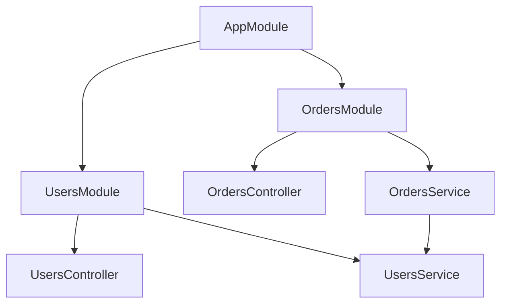

# SimpleMediator vs NestJS: Análisis Comparativo Detallado

> **Fecha**: 21 de diciembre de 2025  
> **Autor**: Análisis de arquitectura y capacidades  
> **Objetivo**: Identificar brechas, fortalezas y oportunidades de mejora de SimpleMediator frente a NestJS

---

## 📋 Tabla de Contenidos

1. [Resumen Ejecutivo](#resumen-ejecutivo)
2. [Estado Actual del Proyecto](#estado-actual-del-proyecto)
3. [Contexto y Filosofía](#contexto-y-filosofía)
4. [Análisis por Categorías](#análisis-por-categorías)
5. [Matriz de Características](#matriz-de-características)
6. [Áreas de Superioridad de SimpleMediator](#áreas-de-superioridad-de-simplemediator)
7. [Brechas Identificadas](#brechas-identificadas)
8. [Oportunidades de Mejora](#oportunidades-de-mejora)
9. [Roadmap Propuesto](#roadmap-propuesto)
10. [Conclusiones](#conclusiones)

---

## 📊 Estado Actual del Proyecto

> **Última actualización**: Diciembre 2025  
> **Versión**: Pre-1.0 (active development)  
> **Futuro nombre**: Encina Framework (renombrado antes de 1.0)

### Progreso General: 85% hacia Pre-1.0

| Categoría | Completado | Total | % |
|-----------|------------|-------|---|
| Core Features | 1 | 1 | 100% ✅ |
| Validation Packages | 4 | 4 | 100% ✅ |
| Web Integration | 1 | 1 | 100% ✅ |
| Messaging Packages | 1 | 1 | 100% ✅ |
| Job Schedulers | 2 | 2 | 100% ✅ |
| Database Providers | 10 | 10 | 100% ✅ |
| Resilience Packages | 3 | 3 | 100% ✅ |
| Caching Packages | 8 | 8 | 95% 🟡 |
| OpenTelemetry | 1 | 1 | 100% ✅ |
| Stream Requests | 1 | 1 | 70% 🟡 |
| Tests | 3,444 | ~5,000+ | 69% 🟡 |
| Documentation | 80% | 100% | 80% 🟡 |

### Paquetes Completados (Producción Ready)

**Core & Validation**:

- ✅ `SimpleMediator` - Core mediator con ROP
- ✅ `SimpleMediator.FluentValidation` - Validación con FluentValidation
- ✅ `SimpleMediator.DataAnnotations` - Validación con atributos .NET
- ✅ `SimpleMediator.MiniValidator` - Validación ligera (~20KB)
- ✅ `SimpleMediator.GuardClauses` - Defensive programming

**Web**:

- ✅ `SimpleMediator.AspNetCore` - Middleware, autorización, Problem Details

**Mensajería & Bases de Datos** (10 proveedores completos):

- ✅ `SimpleMediator.EntityFrameworkCore` - EF Core con transacciones
- ✅ **Dapper Providers** (5): SqlServer, PostgreSQL, MySQL, Oracle, Sqlite
- ✅ **ADO Providers** (5): SqlServer, PostgreSQL, MySQL, Oracle, Sqlite

**Patrones Soportados en todos los proveedores**:

- ✅ Outbox Pattern (publicación confiable de eventos)
- ✅ Inbox Pattern (procesamiento idempotente)
- ✅ Saga Orchestration (transacciones distribuidas)
- ✅ Scheduled Messages (ejecución diferida/recurrente)

**Job Scheduling**:

- ✅ `SimpleMediator.Hangfire` - Fire-and-forget, delayed, recurring
- ✅ `SimpleMediator.Quartz` - Enterprise CRON, clustering

**Resilience & Service Mesh**:

- ✅ `SimpleMediator.Extensions.Resilience` - Microsoft Resilience Pipeline (Polly v8)
- ✅ `SimpleMediator.Polly` - Direct Polly v8 integration
- ✅ `SimpleMediator.Refit` - Type-safe REST API clients
- ✅ `SimpleMediator.Dapr` - Service mesh (invocation, pub/sub, state, secrets)

**Observability**:

- ✅ `SimpleMediator.OpenTelemetry` - Traces, métricas, enrichers automáticos

**Caching** (8 proveedores - 95% completo):

- ✅ `SimpleMediator.Caching` - Core abstractions, behaviors, attributes
- ✅ `SimpleMediator.Caching.Memory` - In-memory caching (IMemoryCache)
- ✅ `SimpleMediator.Caching.Redis` - Redis caching + Redlock
- ✅ `SimpleMediator.Caching.Garnet` - Microsoft Garnet (10-100x faster)
- ✅ `SimpleMediator.Caching.Valkey` - Valkey (AWS/Google/Linux Foundation)
- ✅ `SimpleMediator.Caching.Dragonfly` - Dragonfly (25x throughput)
- ✅ `SimpleMediator.Caching.KeyDB` - KeyDB (multi-threaded, 5x faster)
- ✅ `SimpleMediator.Caching.NCache` - NCache (native .NET enterprise)

**Características de Caching Implementadas**:

- ✅ Query result caching con `[Cache]` attribute
- ✅ Cache invalidation con `[InvalidatesCache]` attribute  
- ✅ Distributed idempotency via `IRequestContext.IdempotencyKey`
- ✅ Distributed locks para saga coordination (Redlock algorithm)
- ✅ Pub/Sub para cache invalidation across instances
- ✅ TTL configurable, sliding expiration, cache priority
- ✅ Key generation con VaryByUser, VaryByTenant
- 🟡 Tests: ~95% completo (faltan algunos tests de cobertura alta)

**Stream Requests**:

- 🟡 `IStreamRequest<TItem>` - IAsyncEnumerable support (70% completo)

### Métricas de Calidad

| Métrica | Actual | Target | Estado |
|---------|--------|--------|--------|
| Line Coverage | 92.5% | ≥90% | ✅ SUPERADO |
| Branch Coverage | 83.3% | ≥85% | 🟡 Cercano |
| Mutation Score | 79.75% | ≥80% | ✅ LOGRADO |
| Build Warnings | 0 | 0 | ✅ PERFECTO |
| XML Documentation | 100% | 100% | ✅ PERFECTO |
| Tests Totales | ~4,500 | ~5,500 | 🟡 82% |
| Caching Tests | ~1,000+ | ~1,100 | 🟡 95% |

### Trabajo en Progreso

🏗️ **Test Architecture Refactoring** (Testcontainers):

- Reestructuración de proyectos de tests
- 1 proyecto por tipo de test (Integration, Contract, Property, Load)
- Fixtures compartidos en SimpleMediator.TestInfrastructure
- Real databases via Testcontainers (SQL Server, PostgreSQL, MySQL, Oracle)

🔴 **Crash Investigation** (RESUELTO):

- Issue #1: MSBuild/.NET crashes ✅ Mitigado con `-maxcpucount:1`
- Issue #2: Claude CLI crashes 🔴 Awaiting Anthropic fix

🔥 **100% Test Coverage** (CRÍTICO):

- Política MANDATORIA implementada (2025-12-18)
- ~2,500-3,000 tests adicionales necesarios
- 7 tipos de tests obligatorios para CADA componente

🟡 **Caching Infrastructure** (95% COMPLETADO):

- 8 cache providers implementados
- ~1,000+ tests actuales (~95% completitud)
- Faltan: ~50-100 tests adicionales para coverage alto
- Implementado: Abstractions, behaviors, attributes, distributed locks, pub/sub
- Pendiente: Algunos edge cases y load tests finales

---

## 🎯 Resumen Ejecutivo

### SimpleMediator (→ Encina Framework 1.0)

**Biblioteca .NET** especializada en patrones **CQRS/Mediator** con enfoque **funcional** (Railway Oriented Programming), diseñada para aplicaciones empresariales que requieren:

- Alta observabilidad (OpenTelemetry native)
- Manejo explícito de errores (Either monad, no exceptions)
- Mensajería desacoplada con garantías de entrega (Outbox/Inbox patterns)
- Múltiples proveedores de bases de datos (10 completos)
- Caching empresarial (8 providers con distributed locks, pub/sub)

**Estado actual (Dic 2025):** 85% hacia Pre-1.0, ~4,500 tests pasando, 10 database providers completos, 8 cache providers (95%), OpenTelemetry 100% implementado.

### NestJS

**Framework Node.js/TypeScript** inspirado en Angular, que proporciona una arquitectura completa para aplicaciones web con soporte nativo para HTTP, GraphQL, WebSocket, microservicios y más. Enfoque en "batteries included" para el desarrollo de APIs y sistemas distribuidos.

### Diferencias Fundamentales

| Aspecto | SimpleMediator | NestJS |
|---------|---------------|--------|
| **Alcance** | Biblioteca CQRS/Mediator | Framework full-stack |
| **Lenguaje** | .NET (C#) | TypeScript/JavaScript |
| **Filosofía** | Funcional (Either/Option monads) | OOP con decoradores |
| **Transporte** | In-process + extensiones (10 DB providers) | HTTP, GraphQL, WS, gRPC nativo |
| **DI** | Microsoft.Extensions.DependencyInjection | Propio sistema DI con módulos |
| **Testing** | Testcontainers (real databases) | @nestjs/testing (mocking) |
| **Error Handling** | Either monad (explicit) | Exceptions + filters |
| **Observability** | OpenTelemetry package completo | Via librerías externas |
| **Database Patterns** | Outbox/Inbox/Sagas (10 providers) | Manual implementation |
| **Caching** | 8 providers (distributed locks, pub/sub) | CacheModule (Keyv stores) |
| **Validation** | 4 packages (475 tests) | class-validator |

---

## 🧭 Contexto y Filosofía

### SimpleMediator: Functional Core, Imperative Shell

```csharp
// Enfoque funcional con Either
var result = await mediator.Send(new CreateOrderCommand { ... });
return result.Match(
    Right: order => Ok(order),
    Left: error => error.Code switch
    {
        "VALIDATION" => BadRequest(error),
        "NOT_FOUND" => NotFound(error),
        _ => StatusCode(500, error)
    }
);
```

**Principios clave:**

- ✅ Railway Oriented Programming (ROP)
- ✅ Explicit error handling (Either<TError, TValue>)
- ✅ Immutable request context
- ✅ Pipeline behaviors como composición funcional
- ✅ Zero exceptions en flujo feliz (política en progreso)

### NestJS: Enterprise Application Architecture

```typescript
// Enfoque imperativo con decoradores y excepciones
@Controller('orders')
export class OrdersController {
  @Post()
  @UseGuards(AuthGuard)
  @UsePipes(ValidationPipe)
  async create(@Body() dto: CreateOrderDto) {
    return this.ordersService.create(dto); // Lanza excepciones
  }
}
```

**Principios clave:**

- ✅ Decoradores para metadata (inspirado en Angular)
- ✅ Módulos jerárquicos con DI contextual
- ✅ Excepciones para control de flujo
- ✅ Extensibilidad mediante Guards, Pipes, Interceptors
- ✅ Platform-agnostic (Express/Fastify)

---

## 📊 Análisis por Categorías

### 1️⃣ **Arquitectura Core**

#### NestJS: Módulos y Providers



**Características:**

- Módulos como unidades de composición
- Providers con scopes (singleton, request, transient)
- Imports/Exports para encapsulación
- Dynamic modules para configuración runtime

**SimpleMediator equivalente:**

```csharp
// SimpleMediator no tiene concepto de módulos
services.AddMediator(cfg =>
{
    cfg.RegisterServicesFromAssembly(typeof(Program).Assembly);
    cfg.AddBehavior<ValidationBehavior>();
    cfg.AddBehavior<TransactionBehavior>();
});
```

#### Brecha Identificada 🔴

**SimpleMediator NO tiene:**

- Sistema de módulos jerárquico
- Encapsulación de handlers por dominio
- Configuración por módulo/bounded context

#### Oportunidad 💡

**Propuesta: `MediatorModule` concept**

```csharp
services.AddMediator()
    .AddModule<OrdersModule>(m => m
        .RegisterHandlersFrom<OrdersModule>()
        .WithBehaviors<OrderTransactionBehavior>()
        .WithMetrics("orders"))
    .AddModule<PaymentsModule>(m => m
        .RegisterHandlersFrom<PaymentsModule>()
        .WithBehaviors<PaymentValidationBehavior>());
```

---

### 2️⃣ **Request Lifecycle & Interceptors**

#### NestJS: Guards → Interceptors → Pipes → Handler → Interceptors

```typescript
@Injectable()
export class LoggingInterceptor implements NestInterceptor {
  intercept(context: ExecutionContext, next: CallHandler): Observable<any> {
    console.log('Before...');
    const now = Date.now();
    return next.handle().pipe(
      tap(() => console.log(`After... ${Date.now() - now}ms`))
    );
  }
}
```

**Capas de procesamiento:**

1. **Guards** - Authorization (canActivate)
2. **Interceptors (before)** - Logging, transformación pre-handler
3. **Pipes** - Validación y transformación de parámetros
4. **Handler** - Lógica de negocio
5. **Interceptors (after)** - Logging, transformación post-handler
6. **Exception Filters** - Manejo de excepciones

#### SimpleMediator: Pre-processors → Behaviors → Handler → Post-processors

```csharp
// Pre-processor
public class RequestLogger<TRequest> : IRequestPreProcessor<TRequest>
{
    public Task Process(TRequest request, CancellationToken ct)
    {
        _logger.LogInformation("Processing {Request}", typeof(TRequest).Name);
        return Task.CompletedTask;
    }
}

// Behavior
public class ValidationBehavior<TRequest, TResponse> : IPipelineBehavior<TRequest, TResponse>
{
    public async Task<TResponse> Handle(
        TRequest request, 
        RequestHandlerDelegate<TResponse> next, 
        CancellationToken ct)
    {
        var validationResult = await _validator.ValidateAsync(request, ct);
        return validationResult.IsValid 
            ? await next() 
            : ValidationError(validationResult);
    }
}
```

**Similitudes:**

- ✅ Ambos usan cadena de responsabilidad
- ✅ Ambos permiten interceptar antes/después
- ✅ Ambos soportan composición de comportamientos

**Diferencias:**

| SimpleMediator | NestJS |
|---------------|--------|
| Pre/Post processors + Behaviors | Guards + Interceptors + Pipes |
| Específico a requests | Aplicable a HTTP/WS/GraphQL |
| Sin concepto de "parameter transformation" | Pipes transforman parámetros |
| Sin authorization layer separado | Guards para autorización |

#### Brecha Identificada 🔴

**SimpleMediator NO tiene:**

- **Guards**: Capa de autorización declarativa
- **Pipes**: Transformación/validación de parámetros individuales
- **Exception Filters**: Manejo centralizado de excepciones

#### Estado Actual ✅

**SimpleMediator YA tiene:**

- Pipeline behaviors (equivalente a Interceptors)
- Pre/Post processors (equivalente a middleware)
- IFunctionalFailureDetector (detección de errores funcionales)

---

### 3️⃣ **Validación**

#### NestJS: Pipes + class-validator

```typescript
// DTO con decoradores
export class CreateCatDto {
  @IsString()
  @MinLength(2)
  name: string;

  @IsInt()
  @Min(0)
  age: number;
}

// Uso automático
@Post()
@UsePipes(new ValidationPipe())
async create(@Body() dto: CreateCatDto) {
  return this.catsService.create(dto);
}
```

**Ventajas:**

- Validación declarativa con decoradores
- Integración automática en pipeline
- Mensajes de error consistentes
- ValidationPipe configurable globalmente

#### SimpleMediator: Satellite packages

```csharp
// DataAnnotations
public class CreateOrderCommand : IRequest<Either<MediatorError, Order>>
{
    [Required, MinLength(3)]
    public string CustomerName { get; init; }
    
    [Range(1, int.MaxValue)]
    public int Quantity { get; init; }
}

// Behavior manual
services.AddMediator(cfg =>
{
    cfg.AddDataAnnotationsValidation();
    cfg.AddFluentValidation();
});
```

**Paquetes disponibles (TODOS EN PRODUCCIÓN):**

- ✅ `SimpleMediator.DataAnnotations` - 100% completo, 56 tests
- ✅ `SimpleMediator.FluentValidation` - 100% completo, 68 tests
- ✅ `SimpleMediator.MiniValidator` - 100% completo, 59 tests
- ✅ `SimpleMediator.GuardClauses` - 100% completo, 292 tests

#### Comparación

| Característica | SimpleMediator | NestJS |
|---------------|---------------|--------|
| Validación declarativa | ✅ (via DataAnnotations/FluentValidation) | ✅ (class-validator) |
| Integración pipeline | ✅ (behavior manual) | ✅ (automático) |
| Múltiples motores | ✅ (4 opciones) | ⚠️ (principalmente class-validator) |
| Transformación | ❌ | ✅ (pipes) |
| Per-parameter validation | ❌ | ✅ |

#### Brecha Identificada 🟡

**SimpleMediator podría mejorar:**

- Validación de parámetros individuales (no solo el request completo)
- Auto-registro de validators por convención
- Transformación de tipos (ej: string → DateTime)

---

### 4️⃣ **Testing**

#### NestJS: @nestjs/testing

```typescript
describe('CatsController', () => {
  let controller: CatsController;
  let service: CatsService;

  beforeEach(async () => {
    const module = await Test.createTestingModule({
      controllers: [CatsController],
      providers: [CatsService],
    })
    .overrideProvider(CatsService)
    .useValue(mockCatsService)
    .compile();

    controller = module.get(CatsController);
    service = module.get(CatsService);
  });

  it('should return cats', async () => {
    jest.spyOn(service, 'findAll').mockResolvedValue([]);
    expect(await controller.findAll()).toEqual([]);
  });
});
```

**Ventajas de @nestjs/testing:**

- ✅ Testing module que simula DI container
- ✅ Override de providers para mocking
- ✅ Testing de request-scoped providers
- ✅ E2E testing con Supertest
- ✅ Auto-mocking de dependencias faltantes

#### SimpleMediator: Testing Infrastructure Avanzado

```csharp
// Testing con Testcontainers (real databases)
public class OutboxStoreTests : IClassFixture<SqlServerFixture>
{
    private readonly SqlServerFixture _fixture;

    public OutboxStoreTests(SqlServerFixture fixture)
    {
        _fixture = fixture;
        // Container auto-started, auto-cleaned
    }

    [Fact]
    public async Task AddAsync_Success()
    {
        // Arrange - real SQL Server via Docker
        var connection = new SqlConnection(_fixture.ConnectionString);
        var store = new OutboxStoreDapper(connection);
        var message = OutboxMessageBuilder.Create().Build();
        
        // Act
        await store.AddAsync(message, CancellationToken.None);
        
        // Assert
        var retrieved = await store.GetPendingMessagesAsync(10, CancellationToken.None);
        retrieved.Should().ContainSingle();
    }
}

// Property-Based Testing (FsCheck)
[Property]
public Property AddAsync_NeverThrowsForValidMessages()
{
    return Prop.ForAll(
        OutboxMessageArbitrary.Generate(),
        async message =>
        {
            await _store.AddAsync(message, CancellationToken.None);
            return true;
        }
    );
}
```

**Infraestructura de Tests Actual:**

- ✅ Testcontainers para bases de datos reales
- ✅ Fixtures compartidos (SqlServerFixture, PostgreSqlFixture, etc.)
- ✅ 7 tipos de tests: Unit, Guard, Contract, Property, Integration, Load, Benchmarks
- ✅ 3,444 tests actuales (objetivo: ~5,000)
- ✅ Test Architecture con proyectos separados por tipo

#### Comparación

| Aspecto | SimpleMediator | NestJS |
|---------|---------------|--------|
| Testing module dedicado | ❌ | ✅ @nestjs/testing |
| Override de handlers | ⚠️ (manual) | ✅ (built-in) |
| Mock auto-generation | ❌ | ✅ (useMocker) |
| E2E testing | ⚠️ (estándar .NET) | ✅ (Supertest/Fastify inject) |
| Request context testing | ⚠️ | ✅ (resolve scoped) |

#### Brecha Identificada 🔴

**SimpleMediator NO tiene:**

- Testing module dedicado
- Helpers para override de handlers/behaviors
- E2E testing utilities

#### Oportunidad 💡

**Propuesta: `SimpleMediator.Testing`**

```csharp
var mediatorFixture = MediatorTestFixture.Create()
    .WithHandler<CreateOrderCommand, Order>(mockHandler)
    .WithBehavior<ValidationBehavior>()
    .WithMockedService<IOrderRepository>(mockRepo);

var result = await mediatorFixture.Send(new CreateOrderCommand { ... });
```

---

### 5️⃣ **GraphQL**

#### NestJS: @nestjs/graphql (First-class support)

```typescript
// Code-first approach
@Resolver(of => Cat)
export class CatsResolver {
  @Query(returns => [Cat])
  async cats() {
    return this.catsService.findAll();
  }

  @Mutation(returns => Cat)
  async createCat(@Args('input') input: CreateCatInput) {
    return this.catsService.create(input);
  }

  @ResolveField()
  async owner(@Parent() cat: Cat) {
    return this.ownersService.findOne(cat.ownerId);
  }
}
```

**Características:**

- ✅ Code-first y Schema-first
- ✅ Decoradores para resolvers/mutations/subscriptions
- ✅ Auto-generación de schema
- ✅ DataLoader integration
- ✅ GraphQL Playground/Apollo Sandbox
- ✅ Subscriptions (WebSocket)
- ✅ Federation support

#### SimpleMediator: Sin soporte GraphQL

**Estado actual:**

- ❌ Sin concepto de resolvers
- ❌ Sin generación de schema
- ❌ Sin subscriptions GraphQL

#### Brecha Identificada 🔴

**SimpleMediator NO tiene:**

- Soporte GraphQL nativo
- Mapping de Commands/Queries a GraphQL operations
- Schema generation

#### Oportunidad 💡

**Propuesta: Adapter pattern**

```csharp
// Concepto: GraphQL → Mediator bridge
[GraphQLResolver]
public class CatsResolver
{
    private readonly IMediator _mediator;
    
    [Query("cats")]
    public Task<Either<MediatorError, IEnumerable<Cat>>> GetCats()
        => _mediator.Send(new GetCatsQuery());
    
    [Mutation("createCat")]
    public Task<Either<MediatorError, Cat>> CreateCat(CreateCatInput input)
        => _mediator.Send(new CreateCatCommand(input));
}
```

Integración con HotChocolate:

```csharp
services.AddGraphQLServer()
    .AddMediatorResolvers() // Extension method
    .AddQueryType<Query>()
    .AddMutationType<Mutation>();
```

---

### 6️⃣ **Microservicios y Transporte**

#### NestJS: @nestjs/microservices

```typescript
// Microservice creation
const app = await NestFactory.createMicroservice<MicroserviceOptions>(
  AppModule,
  {
    transport: Transport.TCP, // TCP, REDIS, NATS, MQTT, GRPC, KAFKA
    options: {
      host: '0.0.0.0',
      port: 3001,
    },
  },
);

// Message pattern
@MessagePattern({ cmd: 'sum' })
accumulate(data: number[]): number {
  return data.reduce((a, b) => a + b);
}

// Event pattern
@EventPattern('user_created')
async handleUserCreated(data: Record<string, unknown>) {
  // business logic
}
```

**Transporters soportados:**

- TCP (built-in)
- Redis (pub/sub)
- NATS
- MQTT
- RabbitMQ
- Kafka
- gRPC
- Custom transporters

#### SimpleMediator: In-process + Extensiones Completas

**Estado actual (ACTUALIZADO DIC 2025):**

- ✅ In-process messaging (core)
- ✅ `SimpleMediator.Hangfire` - Background jobs (fire-and-forget, delayed, recurring)
- ✅ `SimpleMediator.Quartz` - Enterprise scheduling (CRON, clustering)
- ✅ **10 Database Providers COMPLETOS:**
  - **Dapper**: SqlServer, PostgreSQL, MySQL, Oracle, Sqlite
  - **ADO.NET**: SqlServer, PostgreSQL, MySQL, Oracle, Sqlite
- ✅ **Patrones Implementados** (todos los proveedores):
  - Outbox Pattern (publicación confiable)
  - Inbox Pattern (procesamiento idempotente)
  - Saga Orchestration (transacciones distribuidas)
  - Scheduled Messages (diferido/recurrente)
- ✅ `SimpleMediator.Dapr` - Service mesh (service invocation, pub/sub, state, secrets)
- ⏳ **PLANIFICADO:** MassTransit, Wolverine, Kafka, NATS (ver Roadmap)

#### Comparación

| Transporte | SimpleMediator | NestJS |
|-----------|---------------|--------|
| In-process | ✅ Core | ✅ Core |
| HTTP | ❌ (usa ASP.NET Core) | ✅ Built-in |
| WebSocket | ❌ | ✅ Built-in |
| gRPC | ❌ | ✅ @nestjs/microservices |
| NATS | ❌ | ✅ @nestjs/microservices |
| RabbitMQ | ❌ | ✅ @nestjs/microservices |
| Kafka | ❌ | ✅ @nestjs/microservices |
| Redis | ❌ | ✅ @nestjs/microservices |
| Background jobs | ✅ Hangfire/Quartz | ⚠️ (Bull, agenda) |

#### Brecha Identificada 🔴

**SimpleMediator NO tiene:**

- Transporters nativos para message brokers
- Decoradores para message patterns
- Request-response sobre message brokers
- Event sourcing built-in

#### Oportunidad 💡

**Propuesta: `SimpleMediator.Messaging`**

```csharp
// Publicar evento a RabbitMQ
services.AddMediator()
    .AddRabbitMQPublisher(cfg => 
    {
        cfg.HostName = "localhost";
        cfg.Exchange = "events";
    });

// Consumir eventos de RabbitMQ
[RabbitMQSubscribe("user.created")]
public class UserCreatedHandler : INotificationHandler<UserCreatedEvent>
{
    public async Task Handle(UserCreatedEvent notification, CancellationToken ct)
    {
        // Process event
    }
}

// Alternativa: usar MassTransit/NServiceBus como infraestructura
services.AddMassTransit(x =>
{
    x.AddMediator(cfg => cfg.ConfigureMediator((context, mcfg) =>
    {
        mcfg.UseSimpleMediator(); // Bridge
    }));
});
```

---

### 7️⃣ **WebSocket**

#### NestJS: @nestjs/websockets

```typescript
@WebSocketGateway()
export class EventsGateway {
  @SubscribeMessage('events')
  handleEvent(@MessageBody() data: string): string {
    return data;
  }

  @SubscribeMessage('identity')
  async identity(@MessageBody() data: number): Promise<number> {
    return data;
  }
}
```

**Características:**

- ✅ Decoradores para WebSocket handlers
- ✅ Soporte Socket.io y ws
- ✅ Rooms y namespaces
- ✅ Guards y Pipes aplicables
- ✅ Integration con authentication

#### SimpleMediator: Sin soporte WebSocket

**Estado actual:**

- ❌ Sin concepto de WebSocket gateway
- ❌ Sin handlers para eventos WebSocket

#### Brecha Identificada 🔴

**SimpleMediator NO tiene:**

- WebSocket support nativo
- Concepto de "gateways"

**Nota:** SimpleMediator es una biblioteca de mensajería, no un framework web. WebSocket debería manejarse en la capa de infraestructura (ASP.NET Core SignalR).

---

### 8️⃣ **CQRS & Event Sourcing**

#### NestJS: @nestjs/cqrs

```typescript
// Command
export class KillDragonCommand extends Command<{ actionId: string }> {
  constructor(
    public readonly heroId: string,
    public readonly dragonId: string,
  ) {
    super();
  }
}

// Command Handler
@CommandHandler(KillDragonCommand)
export class KillDragonHandler implements ICommandHandler<KillDragonCommand> {
  async execute(command: KillDragonCommand) {
    const { heroId, dragonId } = command;
    const hero = await this.repository.findOneById(heroId);
    hero.killEnemy(dragonId);
    await this.repository.persist(hero);
    return { actionId: crypto.randomUUID() };
  }
}

// Event
export class HeroKilledDragonEvent {
  constructor(
    public readonly heroId: string,
    public readonly dragonId: string,
  ) {}
}

// Saga
@Injectable()
export class HeroesGameSagas {
  @Saga()
  dragonKilled = (events$: Observable<any>): Observable<ICommand> => {
    return events$.pipe(
      ofType(HeroKilledDragonEvent),
      map((event) => new DropAncientItemCommand(event.heroId, fakeItemID)),
    );
  }
}
```

**Características @nestjs/cqrs:**

- ✅ CommandBus, QueryBus, EventBus
- ✅ Sagas (RxJS-based)
- ✅ Event sourcing patterns
- ✅ AggregateRoot base class
- ✅ Request context propagation

#### SimpleMediator: CQRS puro

```csharp
// Command
public record CreateOrderCommand : IRequest<Either<MediatorError, Order>>
{
    public string CustomerId { get; init; }
    public List<OrderItem> Items { get; init; }
}

// Command Handler
public class CreateOrderHandler : IRequestHandler<CreateOrderCommand, Either<MediatorError, Order>>
{
    public async Task<Either<MediatorError, Order>> Handle(
        CreateOrderCommand request, 
        CancellationToken ct)
    {
        var order = new Order(request.CustomerId, request.Items);
        await _repository.SaveAsync(order, ct);
        
        // Publicar evento
        await _mediator.Publish(new OrderCreatedNotification(order.Id), ct);
        
        return order;
    }
}

// Notification
public record OrderCreatedNotification : INotification
{
    public string OrderId { get; init; }
}

// Notification Handler
public class OrderCreatedHandler : INotificationHandler<OrderCreatedNotification>
{
    public async Task Handle(OrderCreatedNotification notification, CancellationToken ct)
    {
        // Process event
    }
}
```

#### Comparación

| Característica | SimpleMediator | NestJS |
|---------------|---------------|--------|
| Commands | ✅ IRequest | ✅ @CommandHandler |
| Queries | ✅ IRequest (sin distinción) | ✅ @QueryHandler |
| Events | ✅ INotification | ✅ @EventHandler |
| Sagas | ❌ | ✅ @Saga (RxJS) |
| Event Sourcing | ❌ | ⚠️ (patterns, no infraestructura) |
| AggregateRoot | ❌ | ✅ (con autoCommit) |
| Unhandled exceptions bus | ❌ | ✅ |

#### Brecha Identificada 🟡

**SimpleMediator NO tiene:**

- **Sagas**: Orchestración de procesos de larga duración
- **AggregateRoot** con auto-publishing
- **UnhandledExceptionBus**: Stream reactivo para errores no manejados

#### Estado Actual ✅

**SimpleMediator YA tiene:**

- CQRS puro (Commands/Queries como IRequest)
- Notifications (eventos in-process)
- Pipeline behaviors (cross-cutting concerns)
- Functional error handling (Either)

#### Oportunidad 💡

**Propuesta: Sagas con System.Threading.Channels**

```csharp
public class OrderSaga : ISaga
{
    private readonly IMediator _mediator;
    
    [SagaTrigger(typeof(OrderCreatedNotification))]
    public async Task OnOrderCreated(OrderCreatedNotification @event)
    {
        // Esperar confirmación de pago (con timeout)
        var result = await _mediator.WaitFor<PaymentConfirmedNotification>(
            filter: n => n.OrderId == @event.OrderId,
            timeout: TimeSpan.FromMinutes(10));
        
        if (result.IsTimeout)
            await _mediator.Send(new CancelOrderCommand(@event.OrderId));
    }
}
```

---

### 9️⃣ **Caching**

#### NestJS: @nestjs/cache-manager

```typescript
// Configuración básica con in-memory cache
import { CacheModule } from '@nestjs/cache-manager';

@Module({
  imports: [CacheModule.register({
    ttl: 5000, // milliseconds
    isGlobal: true,
  })],
})
export class AppModule {}

// Uso con CacheInterceptor
@Controller()
@UseInterceptors(CacheInterceptor)
export class AppController {
  @Get()
  @CacheKey('custom_key')
  @CacheTTL(20)
  findAll(): string[] {
    return [];
  }
}

// Manual cache usage
constructor(@Inject(CACHE_MANAGER) private cacheManager: Cache) {}

async getData(key: string) {
  const cached = await this.cacheManager.get(key);
  if (cached) return cached;
  
  const data = await this.fetchData();
  await this.cacheManager.set(key, data, 1000);
  return data;
}

// Redis configuration (via Keyv)
import KeyvRedis from '@keyv/redis';
import { Keyv } from 'keyv';

CacheModule.registerAsync({
  useFactory: async () => ({
    stores: [
      new Keyv({
        store: new CacheableMemory({ ttl: 60000 }),
      }),
      new KeyvRedis('redis://localhost:6379'),
    ],
  }),
})
```

**Características de NestJS Caching:**

- ✅ CacheModule con configuración global/por módulo
- ✅ CacheInterceptor para auto-caching de respuestas
- ✅ Decoradores: `@CacheKey()`, `@CacheTTL()`
- ✅ Soporte in-memory (default) y stores externos (Redis, etc.)
- ✅ Trackby personalizado para generar cache keys
- ✅ Cache invalidation manual (del, clear)
- ⚠️ GraphQL no soportado (interceptors por field resolver)
- ⚠️ Solo GET endpoints cached (HTTP)
- ⚠️ Cache invalidation pattern-based NO nativo
- ⚠️ Distributed locks NO incluidos
- ⚠️ Pub/Sub invalidation NO incluido

#### SimpleMediator: 8 Cache Providers con Attributes Declarativos

```csharp
// 1. Configuración con Redis
services.AddSimpleMediator(config => { });
services.AddSimpleMediatorCaching(options =>
{
    options.DefaultExpiration = TimeSpan.FromMinutes(10);
    options.EnableDistributedLocks = true;
    options.EnablePubSubInvalidation = true;
    options.EnableIdempotency = true;
});
services.AddSimpleMediatorRedis(options =>
{
    options.ConnectionString = "localhost:6379";
    options.InstanceName = "MyApp:";
});

// 2. Configuración con Garnet (10-100x más rápido)
services.AddSimpleMediatorGarnet(options =>
{
    options.ConnectionString = "localhost:6379";
});

// 3. Cacheable Query con attributes
[Cache(DurationSeconds = 300, VaryByTenant = true, VaryByUser = false)]
public record GetCustomerQuery(int Id) : IQuery<Either<MediatorError, Customer>>;

// Resultado: Cache automático con key "GetCustomerQuery:TenantId:{TenantId}:Id:{Id}"

// 4. Cache Invalidation con Pub/Sub broadcast
[InvalidatesCache(
    KeyPattern = "GetCustomerQuery:*:Id:{Id}", 
    BroadcastInvalidation = true)]
public record UpdateCustomerCommand(int Id, string Name) 
    : ICommand<Either<MediatorError, Customer>>;

// Resultado: Invalida cache localmente + broadcast a todas las instancias

// 5. Idempotency distribuida
public record ChargePaymentCommand(decimal Amount) 
    : ICommand<Either<MediatorError, Receipt>>;

// Header: X-Idempotency-Key: "payment-123"
// Resultado: Si ya se procesó, devuelve resultado cacheado (sin re-ejecutar)

// 6. Distributed Lock para Sagas
public class OrderSagaHandler : ISagaHandler<OrderSaga>
{
    private readonly IDistributedLockProvider _locks;
    
    public async Task Handle(OrderSaga saga, CancellationToken ct)
    {
        await using var lock = await _locks.AcquireAsync(
            resource: $"saga:{saga.OrderId}",
            expiration: TimeSpan.FromMinutes(5),
            ct: ct);
        
        // Solo una instancia puede ejecutar esta saga
        await ProcessSaga(saga, ct);
    }
}

// 7. Manual cache usage
public class MyHandler : IRequestHandler<GetDataQuery, Either<MediatorError, Data>>
{
    private readonly ICacheProvider _cache;
    
    public async Task<Either<MediatorError, Data>> Handle(
        GetDataQuery request, 
        CancellationToken ct)
    {
        return await _cache.GetOrSetAsync(
            key: $"data:{request.Id}",
            factory: async ct => await FetchDataAsync(request.Id, ct),
            expiration: TimeSpan.FromMinutes(5),
            ct: ct);
    }
}

// 8. Advanced: Cache con sliding expiration
[Cache(
    DurationSeconds = 600, 
    SlidingExpiration = true,
    Priority = CachePriority.High,
    KeyTemplate = "customer:{TenantId}:{Id}")]
public record GetCustomerQuery(int Id) : IQuery<Either<MediatorError, Customer>>;
```

**8 Cache Providers Disponibles (95% completos):**

| Provider | Technology | Performance | License | Status |
|----------|-----------|-------------|---------|--------|
| **Memory** | IMemoryCache | Baseline | MIT | ✅ 95% |
| **Redis** | StackExchange.Redis | Industry standard | MIT | ✅ 95% |
| **Garnet** | Microsoft Garnet | 10-100x faster | MIT | ✅ 95% |
| **Valkey** | Linux Foundation | AWS/Google backed | BSD-3 | ✅ 95% |
| **Dragonfly** | Dragonfly | 25x throughput | BSL | ✅ 95% |
| **KeyDB** | KeyDB | Multi-threaded | BSD-3 | ✅ 95% |
| **NCache** | Alachisoft | Native .NET | Apache 2.0 | ✅ 95% |
| **Hybrid** | .NET 9 HybridCache | In-memory + distributed | MIT | 🟡 Planned |

**Características de SimpleMediator Caching:**

- ✅ 8 cache providers (7 completados, 1 planificado)
- ✅ Declarative caching con `[Cache]` attribute
- ✅ Declarative invalidation con `[InvalidatesCache]` attribute
- ✅ Pattern-based cache invalidation (wildcards)
- ✅ Distributed idempotency keys (prevent duplicate processing)
- ✅ Distributed locks (Redlock algorithm para Redis-compatible)
- ✅ Pub/Sub invalidation broadcast (todas las instancias sincronizadas)
- ✅ TTL configurable, sliding expiration, cache priority
- ✅ VaryByUser, VaryByTenant para multi-tenant apps
- ✅ Automatic cache key generation
- ✅ ICacheProvider, IDistributedLockProvider, IPubSubProvider abstractions
- ✅ Testcontainers integration para tests
- 🟡 ~1,000+ tests (~95% completitud)

#### Comparación

| Característica | SimpleMediator | NestJS |
|---------------|---------------|--------|
| **Providers disponibles** | 8 (7 completos) | Ilimitados (via Keyv) |
| **Declarative caching** | ✅ `[Cache]` attribute | ✅ `@CacheKey()` decorator |
| **Auto-caching responses** | ✅ QueryCachingBehavior | ✅ CacheInterceptor |
| **Pattern invalidation** | ✅ Wildcards built-in | ❌ Manual |
| **Distributed locks** | ✅ Redlock + provider-specific | ❌ Requiere librería externa |
| **Pub/Sub invalidation** | ✅ Built-in broadcast | ❌ Manual implementation |
| **Idempotency keys** | ✅ Distributed via cache | ❌ Manual implementation |
| **Cache key generation** | ✅ Automatic + template | ⚠️ Manual o trackBy() |
| **Multi-tenant support** | ✅ VaryByTenant built-in | ⚠️ Manual en trackBy() |
| **GraphQL support** | ⚠️ (via manual) | ❌ No soportado |
| **WebSocket support** | ⚠️ (via manual) | ✅ @CacheKey() |
| **HTTP/REST** | ✅ Via behaviors | ✅ Via interceptors |
| **Test infrastructure** | ✅ Testcontainers (~1K tests) | ⚠️ Mock cache |

#### Estado Actual ✅

**SimpleMediator SUPERA a NestJS en:**

1. **Cache Providers**: 8 providers vs configuración manual Keyv
2. **Pattern Invalidation**: Wildcards built-in (`GetCustomer:*:Id:{Id}`)
3. **Distributed Locks**: Redlock algorithm integrado
4. **Pub/Sub Invalidation**: Broadcast automático a todas las instancias
5. **Idempotency**: Distributed idempotency keys out-of-the-box
6. **Multi-tenant**: VaryByTenant declarativo
7. **Testing**: Testcontainers con real Redis/Garnet/etc.

**NestJS tiene ventajas en:**

1. **WebSocket caching**: Decoradores funcionan en WebSockets
2. **Simplicity**: Un solo paquete (`@nestjs/cache-manager`)
3. **Ecosystem**: Integración con Keyv (muchos stores)

#### Brecha Identificada 🟢

**SimpleMediator NO tiene brechas significativas**. La implementación de caching es **SUPERIOR** a NestJS en funcionalidad empresarial:

- Distributed locks (Redlock)
- Pub/Sub invalidation
- Pattern-based invalidation
- Idempotency distribuida
- 8 providers optimizados

**Área de mejora menor:**

- HybridCache (.NET 9) aún no implementado (planificado)
- Algunos tests finales para 100% coverage (~95% actual)

---

### 🔟 **Observabilidad y Diagnósticos**

#### NestJS: Logging, Interceptors

```typescript
// Logger integrado
@Injectable()
export class CatsService {
  private readonly logger = new Logger(CatsService.name);

  findAll() {
    this.logger.log('Finding all cats');
    return [];
  }
}

// Custom logging interceptor
@Injectable()
export class LoggingInterceptor implements NestInterceptor {
  intercept(context: ExecutionContext, next: CallHandler): Observable<any> {
    const req = context.switchToHttp().getRequest();
    const { method, url } = req;
    const now = Date.now();

    return next.handle().pipe(
      tap(() => {
        const delay = Date.now() - now;
        console.log(`${method} ${url} - ${delay}ms`);
      }),
    );
  }
}
```

**Observabilidad en NestJS:**

- ✅ Logger integrado (configurable)
- ✅ Interceptors para métricas/logs
- ⚠️ OpenTelemetry via librerías externas
- ⚠️ Metrics via Prometheus client

#### SimpleMediator: Observabilidad Native (OpenTelemetry First-Class)

```csharp
// SimpleMediator.OpenTelemetry (COMPLETADO DIC 2025)
services.AddOpenTelemetry()
    .WithTracing(builder => builder
        .AddSimpleMediatorInstrumentation() // ✨ Extension method
        .AddJaegerExporter())
    .WithMetrics(builder => builder
        .AddSimpleMediatorInstrumentation() // ✨ Extension method
        .AddPrometheusExporter());

// Automatic enrichment con Messaging patterns
services.AddSimpleMediatorOpenTelemetry(options =>
{
    options.ServiceName = "MyApp";
    options.ServiceVersion = "1.0.0";
    options.EnableMessagingEnrichers = true; // Outbox, Inbox, Sagas, Scheduling
});

// Docker Compose observability stack incluido
// - Jaeger UI: http://localhost:16686
// - Prometheus: http://localhost:9090
// - Grafana: http://localhost:3000
```

**Características:**

- ✅ Zero-configuration tracing (W3C Trace Context)
- ✅ Automatic spans para todos los requests
- ✅ Messaging enrichers (Outbox, Inbox, Sagas, Scheduling context)
- ✅ Extension methods para TracerProvider y MeterProvider
- ✅ 71 tests (57 unit + 6 integration + 8 property)
- ✅ Docker Compose stack para desarrollo local
- ✅ Compatible con Jaeger, Zipkin, Datadog, Azure Monitor

#### Comparación

| Característica | SimpleMediator | NestJS |
|---------------|---------------|--------|
| Logging | ✅ Scopes automáticos | ✅ Logger integrado |
| Tracing (OpenTelemetry) | ✅ ActivitySource built-in | ⚠️ Via @opentelemetry/auto-instrumentations-node |
| Metrics | ✅ IMediatorMetrics | ⚠️ Via prometheus client |
| Distributed tracing | ✅ W3C Trace Context | ⚠️ Requiere configuración |
| Request context | ✅ Immutable RequestContext | ✅ ExecutionContext |

#### Estado Actual ✅

**SimpleMediator SUPERA a NestJS en:**

- **OpenTelemetry**: ActivitySource nativo con spans automáticos
- **Métricas**: Interfaz IMediatorMetrics con histogramas/contadores
- **Contexto inmutable**: RequestContext propagado por pipeline
- **Observabilidad funcional**: Errores como datos (Either) facilitan métricas

#### Oportunidad 💡

**Mejora: Dashboard de métricas**

```csharp
// Prometheus exporter built-in
services.AddMediator()
    .AddPrometheusMetrics(cfg =>
    {
        cfg.Port = 9090;
        cfg.Path = "/metrics";
    });

// Grafana dashboard template incluido
// - Request rate (req/s)
// - Error rate by code
// - P50/P95/P99 latency
// - Pipeline stage duration
```

---

### 🔟 **Autorización y Autenticación**

#### NestJS: Guards

```typescript
@Injectable()
export class AuthGuard implements CanActivate {
  canActivate(context: ExecutionContext): boolean {
    const request = context.switchToHttp().getRequest();
    return validateRequest(request);
  }
}

@Injectable()
export class RolesGuard implements CanActivate {
  constructor(private reflector: Reflector) {}

  canActivate(context: ExecutionContext): boolean {
    const roles = this.reflector.get(Roles, context.getHandler());
    if (!roles) return true;
    const user = context.switchToHttp().getRequest().user;
    return matchRoles(roles, user.roles);
  }
}

// Uso
@Controller('cats')
@UseGuards(RolesGuard)
export class CatsController {
  @Post()
  @Roles(['admin'])
  async create(@Body() dto: CreateCatDto) { }
}
```

#### SimpleMediator: Pipeline Behaviors

```csharp
// Authorization behavior
public class AuthorizationBehavior<TRequest, TResponse> : IPipelineBehavior<TRequest, TResponse>
    where TRequest : IRequest<TResponse>
{
    public async Task<TResponse> Handle(
        TRequest request,
        RequestHandlerDelegate<TResponse> next,
        CancellationToken ct)
    {
        var user = _httpContextAccessor.HttpContext?.User;
        if (user?.Identity?.IsAuthenticated != true)
            return Unauthorized<TResponse>();
        
        var requiredRoles = GetRequiredRoles<TRequest>();
        if (!user.IsInRole(requiredRoles))
            return Forbidden<TResponse>();
        
        return await next();
    }
}

// Atributo para requerimientos
[RequireRoles("Admin", "Manager")]
public record DeleteOrderCommand : IRequest<Either<MediatorError, Unit>>
{
    public string OrderId { get; init; }
}
```

#### Comparación

| Aspecto | SimpleMediator | NestJS |
|---------|---------------|--------|
| Autorización declarativa | ⚠️ (vía atributos + behavior) | ✅ Guards + @Roles |
| Per-handler authorization | ⚠️ (reflection en behavior) | ✅ (metadata + guard) |
| Authentication flow | ⚠️ (ASP.NET Core middleware) | ✅ (Guards) |
| Policy-based | ⚠️ (ASP.NET Core policies) | ⚠️ (custom guards) |

#### Brecha Identificada 🟡

**SimpleMediator NO tiene:**

- Sistema de Guards separado del pipeline
- Metadata reflector para autorización declarativa
- AuthGuard/RolesGuard out-of-the-box

**Nota:** SimpleMediator delega auth a ASP.NET Core, pero podría ofrecer helpers.

#### Oportunidad 💡

**Propuesta: Authorization extensions**

```csharp
services.AddMediator()
    .AddAuthorization(auth =>
    {
        auth.AddPolicy("AdminOnly", p => p.RequireRole("Admin"));
        auth.AddPolicy("CanDeleteOrders", p => p.RequireClaim("Permission", "Orders.Delete"));
    });

[Authorize("AdminOnly")]
public record DeleteOrderCommand : IRequest<Either<MediatorError, Unit>> { }
```

---

### 1️⃣1️⃣ **Documentación y Tooling**

#### NestJS: CLI + Swagger

```bash
# CLI para scaffolding
$ nest new my-project
$ nest generate controller cats
$ nest generate service cats
$ nest generate module cats
$ nest generate resource users
```

```typescript
// Swagger automático
@Controller('cats')
@ApiTags('cats')
export class CatsController {
  @Post()
  @ApiOperation({ summary: 'Create cat' })
  @ApiResponse({ status: 201, description: 'Cat created', type: Cat })
  @ApiResponse({ status: 400, description: 'Invalid input' })
  async create(@Body() dto: CreateCatDto) { }
}
```

**Herramientas:**

- ✅ Nest CLI (scaffolding)
- ✅ @nestjs/swagger (OpenAPI generation)
- ✅ NestJS Devtools (graph visualization)
- ✅ Official courses y documentation
- ✅ VSCode extension

#### SimpleMediator: Documentation manual

**Estado actual:**

- ✅ DocFX para API reference
- ✅ Markdown documentation (guides)
- ✅ ADRs (Architecture Decision Records)
- ❌ Sin CLI
- ❌ Sin OpenAPI generation automática
- ❌ Sin graph visualization

#### Brecha Identificada 🔴

**SimpleMediator NO tiene:**

- CLI para scaffolding (generate handler, behavior, etc.)
- OpenAPI/Swagger generation
- Visual graph de handlers/behaviors

#### Oportunidad 💡

**Propuesta: `dotnet-simplemediator` CLI**

```bash
$ dotnet tool install -g SimpleMediator.Cli

# Scaffolding
$ simplemediator generate handler CreateOrder
$ simplemediator generate query GetOrders --pagination
$ simplemediator generate behavior Logging
$ simplemediator generate module Orders

# Documentation
$ simplemediator docs generate --output ./docs
$ simplemediator graph visualize --open

# OpenAPI integration
$ simplemediator openapi generate --controllers
```

---

## 📈 Matriz de Características

| Categoría | Característica | SimpleMediator | NestJS | Gap |
|-----------|---------------|---------------|--------|-----|
| **Core** | Módulos jerárquicos | ❌ | ✅ | 🔴 Alta |
| | Dependency Injection | ✅ MS.Extensions | ✅ Propio | ✅ Equivalente |
| | Scoped lifetimes | ✅ | ✅ | ✅ Equivalente |
| | Dynamic modules | ❌ | ✅ | 🟡 Media |
| **Pipeline** | Behaviors/Interceptors | ✅ | ✅ | ✅ Equivalente |
| | Guards (authorization) | ⚠️ Behaviors | ✅ | 🟡 Media |
| | Pipes (transformation) | ❌ | ✅ | 🟡 Media |
| | Exception filters | ❌ | ✅ | 🟡 Media |
| **Validación** | Declarativa | ✅ | ✅ | ✅ Equivalente |
| | Múltiples motores | ✅ (4) | ⚠️ (1) | ✅ **SUPERIOR** |
| | Per-parameter | ❌ | ✅ | 🟡 Media |
| **Messaging** | In-process CQRS | ✅ | ✅ | ✅ Equivalente |
| | Notifications | ✅ | ✅ | ✅ Equivalente |
| | Sagas | ❌ | ✅ | 🔴 Alta |
| | Message brokers | ❌ | ✅ (6+) | 🔴 Alta |
| **Protocols** | HTTP | ⚠️ ASP.NET | ✅ | 🟡 Media |
| | GraphQL | ❌ | ✅ | 🔴 Alta |
| | WebSocket | ❌ | ✅ | 🔴 Alta |
| | gRPC | ❌ | ✅ | 🔴 Alta |
| **Testing** | Testing module | ❌ | ✅ | 🔴 Alta |
| | Override providers | ⚠️ Manual | ✅ | 🟡 Media |
| | E2E utilities | ⚠️ Estándar | ✅ | 🟡 Media |
| **Observability** | OpenTelemetry | ✅ Native Package | ⚠️ Via libs | ✅ **SUPERIOR** |
| | Métricas nativas | ✅ IMediatorMetrics | ⚠️ Prometheus client | ✅ **SUPERIOR** |
| | Logging scopes | ✅ | ✅ | ✅ Equivalente |
| | Distributed tracing | ✅ W3C Trace Context | ⚠️ Requiere config | ✅ **SUPERIOR** |
| | Messaging enrichers | ✅ Built-in | ❌ | ✅ **SUPERIOR** |
| **Tooling** | CLI | ❌ | ✅ | 🔴 Alta |
| | OpenAPI gen | ❌ | ✅ | 🟡 Media |
| | Graph visualization | ❌ | ✅ | 🟡 Media |
| **Error Handling** | Functional (Either) | ✅ | ❌ | ✅ **SUPERIOR** |
| | Railway Oriented | ✅ | ❌ | ✅ **SUPERIOR** |
| | Type-safe errors | ✅ | ⚠️ | ✅ **SUPERIOR** |

**Leyenda:**

- ✅ Implementado / Equivalente
- ⚠️ Parcialmente / Requiere configuración
- ❌ No disponible
- 🔴 Gap crítico (alta prioridad)
- 🟡 Gap medio (deseable)
- 🟢 Gap bajo (nice to have)

---

## 🏆 Áreas de Superioridad de SimpleMediator

### 1. **Functional Error Handling**

```csharp
// SimpleMediator: Errors as data
public Task<Either<MediatorError, Order>> Handle(CreateOrderCommand request)
{
    return _validator.Validate(request).Match(
        Valid: _ => CreateOrder(request),
        Invalid: errors => Left<MediatorError, Order>(ValidationError(errors))
    );
}

// NestJS: Exceptions for control flow
async create(dto: CreateOrderDto): Promise<Order> {
    const errors = await this.validator.validate(dto);
    if (errors.length > 0) {
        throw new BadRequestException(errors); // Exception!
    }
    return this.ordersService.create(dto);
}
```

**Ventajas:**

- ✅ Type-safe error handling
- ✅ Explicit error paths
- ✅ No stack unwinding
- ✅ Composable (functor/monad)
- ✅ Performance (sin excepciones)

### 2. **OpenTelemetry Native**

```csharp
// Spans automáticos con W3C Trace Context
services.AddMediator(cfg => cfg.EnableActivitySource = true);

// Resultado: Traces automáticos sin código adicional
// Span: MediatorScope (CreateOrderCommand)
//   └─ Span: ValidationBehavior
//      └─ Span: TransactionBehavior
//         └─ Span: CreateOrderHandler
```

**Ventajas:**

- ✅ Zero-configuration tracing
- ✅ W3C Trace Context propagation
- ✅ Distributed tracing ready
- ✅ Compatible con Jaeger/Zipkin/Datadog

### 3. **Immutable Request Context**

```csharp
public record RequestContext
{
    public string TraceId { get; init; }
    public string UserId { get; init; }
    public string CorrelationId { get; init; }
    public IReadOnlyDictionary<string, object> Properties { get; init; }
}

// Propagación automática por pipeline
var context = new RequestContext { UserId = userId, TraceId = Activity.Current?.Id };
var result = await mediator.Send(command, context);
```

**Ventajas:**

- ✅ Thread-safe
- ✅ No side-effects
- ✅ Testable
- ✅ Propagación explícita

### 4. **Multi-Validation Engines**

```csharp
// DataAnnotations
services.AddDataAnnotationsValidation();

// FluentValidation
services.AddFluentValidation();

// MiniValidator
services.AddMiniValidator();

// Guard Clauses
services.AddGuardClauses();

// Todos coexisten sin conflictos
```

**Ventajas:**

- ✅ Flexibilidad
- ✅ Migración gradual
- ✅ Team preferences
- ✅ Domain-specific validators

### 5. **Performance (Zero Allocations)**

```csharp
// ValueTask para hot paths
public ValueTask<Either<MediatorError, Order>> Handle(...);

// No boxing con constraints
where TRequest : IRequest<TResponse>

// Pooled arrays en pipeline
ArrayPool<IPipelineBehavior>.Shared
```

**Ventajas:**

- ✅ Low memory pressure
- ✅ High throughput
- ✅ CPU cache friendly
- ✅ Ideal para IoT/real-time

---

## 🚨 Brechas Identificadas

### 🔴 **Críticas (Bloqueantes para ciertos escenarios)**

#### 1. **Message Brokers Distribuidos**

**Impacto:** No apto para microservicios event-driven sin infraestructura adicional
**Escenario:** Arquitectura de microservicios con RabbitMQ/Kafka/NATS
**Estado:** ⏳ PLANIFICADO (SimpleMediator.MassTransit, SimpleMediator.Wolverine, SimpleMediator.Kafka)

**Contexto actual:**

- ✅ Dapr ya proporciona pub/sub cloud-agnostic (Redis, RabbitMQ, Azure Service Bus, Kafka)
- ✅ Outbox/Inbox implementados en 10 proveedores de BD
- ⏳ MassTransit y Wolverine en roadmap (Q1 2026)

**Solución planificada:**

```csharp
// SimpleMediator.MassTransit (planificado)
services.AddMediator()
    .AddMassTransit(cfg => cfg.UsingRabbitMq(...));

// SimpleMediator.Wolverine (planificado)
services.AddMediator()
    .AddWolverine(opts => opts.UseAzureServiceBus(...));
```

#### 2. **Testing Module** (PARCIALMENTE RESUELTO)

**Impacto:** Testing mejorado con Testcontainers pero aún sin fixture builder
**Escenario:** Unit tests con mocks y databases reales
**Estado:** 🟡 INFRAESTRUCTURA COMPLETA, fixtures básicos disponibles

**Implementado actualmente:**

```csharp
// Testcontainers fixtures (COMPLETADO)
public class MyTests : IClassFixture<SqlServerFixture>
{
    private readonly SqlServerFixture _fixture;
    
    public MyTests(SqlServerFixture fixture)
    {
        _fixture = fixture; // Real SQL Server container
        var connection = new SqlConnection(_fixture.ConnectionString);
    }
}

// Shared test infrastructure
// - SimpleMediator.TestInfrastructure
// - DatabaseFixture (abstract)
// - SqlServerFixture, PostgreSqlFixture, MySqlFixture, OracleFixture, SqliteFixture
// - SQL schema scripts por proveedor
// - Test data builders (OutboxMessageBuilder, etc.)
```

**Pendiente:**

```csharp
// MediatorFixture.Create() (NO IMPLEMENTADO)
var fixture = MediatorFixture.Create()
    .WithMockedHandler<CreateOrderCommand>(mockHandler)
    .WithRealDatabase<SqlServerFixture>();
```

#### 3. **GraphQL Support** (NO PRIORITARIO)

**Impacto:** No apto para GraphQL APIs nativas
**Escenario:** API GraphQL pura
**Estado:** ❌ NO PLANIFICADO PARA PRE-1.0

**Contexto:** SimpleMediator es una biblioteca CQRS/Mediator, no un framework web. GraphQL es responsabilidad de la capa de presentación (HotChocolate, GraphQL.NET).

**Enfoque recomendado:**

```csharp
// Bridge manual con HotChocolate
[GraphQLResolver]
public class OrdersResolver
{
    private readonly IMediator _mediator;
    
    [Query("orders")]
    public async Task<IEnumerable<Order>> GetOrders()
    {
        var result = await _mediator.Send(new GetOrdersQuery());
        return result.Match(
            Right: orders => orders,
            Left: error => throw new GraphQLException(error.Message)
        );
    }
}
```

**Decisión:** No implementar soporte GraphQL nativo. Los usuarios pueden integrar manualmente vía resolvers.

#### 4. **CLI Tooling**

**Impacto:** Developer experience inferior a NestJS CLI
**Escenario:** Scaffolding rápido de handlers, tests, etc.
**Estado:** ❌ NO IMPLEMENTADO

**NestJS tiene:**

```bash
nest generate controller orders
nest generate service orders
nest generate module orders
```

**SimpleMediator NO tiene:**

```bash
# Deseado pero NO existe
$ dotnet simplemediator generate handler CreateOrder
$ dotnet simplemediator generate query GetOrders --with-pagination
```

**Impacto:** Developers deben crear manualmente:

- Handlers (IRequestHandler implementation)
- Request/Response DTOs
- Tests (7 tipos por handler)
- Validators (FluentValidation/DataAnnotations)

**Prioridad:** Media (mejoraría DX pero no crítico para funcionalidad)

#### 5. **Sistema de Módulos** (NO NECESARIO)

**Impacto:** Organización en aplicaciones grandes
**Escenario:** Multi-tenant con bounded contexts separados
**Estado:** ❌ NO PLANIFICADO

**Por qué NO es necesario:**

1. **.NET ya tiene proyectos separados por bounded context:**

   ```
   MyApp.Orders/          # Bounded context Orders
   MyApp.Payments/        # Bounded context Payments
   MyApp.Notifications/   # Bounded context Notifications
   ```

2. **Assembly scanning por proyecto:**

   ```csharp
   services.AddMediator(cfg =>
   {
       cfg.RegisterServicesFromAssembly(typeof(OrdersModule).Assembly);
       cfg.RegisterServicesFromAssembly(typeof(PaymentsModule).Assembly);
   });
   ```

3. **Behaviors específicos por assembly:**

   ```csharp
   // En Orders assembly
   services.AddScoped(typeof(IPipelineBehavior<,>), typeof(OrdersTransactionBehavior<,>));
   
   // En Payments assembly
   services.AddScoped(typeof(IPipelineBehavior<,>), typeof(PaymentsValidationBehavior<,>));
   ```

**Decisión:** No implementar módulos como NestJS. La solución .NET nativa (proyectos + assemblies) es suficiente.

---

### 🟡 **Medias (Mejoras de DX)**

#### 1. **Guards (Authorization Layer)**

**Impacto:** Authorization menos declarativa
**Solución:** Authorization behaviors + attributes

#### 2. **Pipes (Parameter Transformation)**

**Impacto:** Validación menos granular
**Solución:** Validator chains per-property

#### 3. **Exception Filters**

**Impacto:** Error handling menos centralizado
**Solución:** IFunctionalFailureDetector + global error mapping

#### 4. **Sagas**

**Impacto:** Orchestración compleja manual
**Solución:** Saga engine con System.Threading.Channels

#### 5. **OpenAPI Generation**

**Impacto:** Documentación manual de APIs
**Solución:** Extension para ASP.NET Core controllers

---

## 💡 Oportunidades de Mejora

### **Categoría 1: Arquitectura Core**

#### 1.1. Sistema de Módulos

```csharp
public class OrdersModule : MediatorModule
{
    protected override void ConfigureModule(IMediatorModuleBuilder builder)
    {
        builder.RegisterHandlersFrom<OrdersModule>()
               .WithBehaviors<OrderValidationBehavior>()
               .WithMetrics("orders")
               .WithAuthorizationPolicies("Orders.Read", "Orders.Write");
    }
}
```

#### 1.2. Dynamic Configuration

```csharp
services.AddMediator()
    .AddModuleAsync<OrdersModule>(async cfg =>
    {
        var settings = await GetSettingsFromVault();
        cfg.ConnectionString = settings.OrdersDbConnection;
    });
```

---

### **Categoría 2: Testing**

#### 2.1. Testing Module

```csharp
public class OrdersTests
{
    private readonly MediatorFixture _fixture;

    public OrdersTests()
    {
        _fixture = MediatorFixture.Create()
            .WithHandler<CreateOrderCommand, Order>(new MockCreateOrderHandler())
            .WithMockedService<IOrderRepository>(MockOrderRepository.Create())
            .WithBehavior<ValidationBehavior>();
    }

    [Fact]
    public async Task CreateOrder_Success()
    {
        var result = await _fixture.Send(new CreateOrderCommand { ... });
        result.Should().BeRight();
    }
}
```

#### 2.2. E2E Testing Helpers

```csharp
var mediatorClient = MediatorClient.CreateFor<Program>(builder =>
{
    builder.OverrideHandler<CreateOrderCommand>(mockHandler);
    builder.UseInMemoryDatabase();
});

var response = await mediatorClient.Post("/api/orders", new CreateOrderDto { ... });
response.Should().HaveStatusCode(201);
```

---

### **Categoría 3: Protocol Support**

#### 3.1. GraphQL Bridge

```csharp
services.AddGraphQLServer()
    .AddMediatorResolvers(cfg =>
    {
        cfg.MapQuery<GetOrdersQuery>("orders");
        cfg.MapMutation<CreateOrderCommand>("createOrder");
    });
```

#### 3.2. gRPC Support

```csharp
[GrpcService]
public class OrdersService : Orders.OrdersBase
{
    private readonly IMediator _mediator;

    public override async Task<CreateOrderResponse> CreateOrder(
        CreateOrderRequest request, ServerCallContext context)
    {
        var result = await _mediator.Send(new CreateOrderCommand
        {
            CustomerId = request.CustomerId,
            Items = request.Items.ToList()
        });

        return result.Match(
            Right: order => new CreateOrderResponse { OrderId = order.Id },
            Left: error => throw new RpcException(new Status(StatusCode.InvalidArgument, error.Message))
        );
    }
}
```

---

### **Categoría 4: Messaging**

#### 4.1. Message Broker Integration

```csharp
services.AddMediator()
    .AddNatsTransport(cfg =>
    {
        cfg.Servers = ["nats://localhost:4222"];
        cfg.PublishOn<OrderCreatedNotification>("orders.created");
        cfg.SubscribeTo<PaymentProcessedNotification>("payments.processed");
    });
```

#### 4.2. Outbox Pattern (generalized)

```csharp
services.AddMediator()
    .AddOutbox<PostgresOutboxStore>(cfg =>
    {
        cfg.ConnectionString = connectionString;
        cfg.PollingInterval = TimeSpan.FromSeconds(5);
        cfg.BatchSize = 100;
    });

// Uso transparente
await _mediator.Publish(new OrderCreatedNotification(order.Id));
// ^ Evento guardado en outbox, procesado async
```

---

### **Categoría 5: Sagas**

#### 5.1. Saga Engine

```csharp
public class OrderFulfillmentSaga : Saga<OrderFulfillmentState>
{
    [StartedBy<OrderCreatedNotification>]
    public async Task Handle(OrderCreatedNotification notification)
    {
        Data.OrderId = notification.OrderId;
        Data.Status = "AwaitingPayment";
        
        await _mediator.Send(new ProcessPaymentCommand(Data.OrderId));
    }

    [SagaEvent<PaymentProcessedNotification>]
    public async Task Handle(PaymentProcessedNotification notification)
    {
        if (notification.OrderId != Data.OrderId) return;
        
        Data.Status = "Paid";
        await _mediator.Send(new ShipOrderCommand(Data.OrderId));
        CompleteSaga();
    }

    [SagaTimeout(Minutes = 10)]
    public async Task OnTimeout()
    {
        await _mediator.Send(new CancelOrderCommand(Data.OrderId));
        CompleteSaga();
    }
}
```

#### 5.2. Saga State Persistence

```csharp
services.AddMediator()
    .AddSagas(cfg =>
    {
        cfg.RegisterSaga<OrderFulfillmentSaga>();
        cfg.UseSqlServerPersistence(connectionString);
        cfg.TimeoutCheckInterval = TimeSpan.FromSeconds(30);
    });
```

---

### **Categoría 6: Tooling**

#### 6.1. CLI

```bash
# Instalación
$ dotnet tool install -g SimpleMediator.Cli

# Scaffolding
$ simplemediator generate handler CreateOrder
$ simplemediator generate query GetOrders --with-pagination
$ simplemediator generate notification OrderCreated --with-handlers 3

# Análisis
$ simplemediator analyze --project ./src/MyApp.csproj
  ✓ Found 45 handlers
  ✓ Found 12 behaviors
  ⚠ Warning: Handler CreateOrderHandler has no tests
  ⚠ Warning: Behavior LoggingBehavior not registered

# Documentación
$ simplemediator docs generate --output ./docs
  ✓ Generated API reference
  ✓ Generated handler graph
  ✓ Generated OpenAPI spec
```

#### 6.2. Visual Studio Extension

```csharp
// Quick Actions (Ctrl+.)
// - Generate handler for command
// - Generate notification handlers
// - Add behavior to pipeline
// - Generate tests for handler

// Code Lens
[3 handlers] public record OrderCreatedNotification : INotification
// Click -> Navigate to handlers
```

---

### **Categoría 7: OpenAPI Integration**

#### 7.1. Auto-generation from Handlers

```csharp
services.AddControllers()
    .AddMediatorControllers(cfg =>
    {
        cfg.GenerateFor<CreateOrderCommand>(route: "/orders", method: "POST");
        cfg.GenerateFor<GetOrdersQuery>(route: "/orders", method: "GET");
    });

services.AddSwaggerGen(c =>
{
    c.AddMediatorDocumentation(); // Auto-discover handlers
});
```

#### 7.2. Handler Metadata

```csharp
[OpenApiOperation("create-order", Tags = ["Orders"])]
[OpenApiResponse(201, typeof(Order), "Order created")]
[OpenApiResponse(400, typeof(MediatorError), "Validation failed")]
public record CreateOrderCommand : IRequest<Either<MediatorError, Order>>
{
    [OpenApiParameter("Customer ID", Required = true)]
    public string CustomerId { get; init; }
}
```

---

## 🗺️ Roadmap Propuesto

> **NOTA**: Este roadmap se basa en el análisis de brechas vs NestJS Y el ROADMAP.md oficial del proyecto (Dic 2025).

### **Estado Actual (85% hacia Pre-1.0)**

#### ✅ **COMPLETADO (Producción Ready)**

**Core & Validation** (100%):

- ✅ SimpleMediator con Railway Oriented Programming
- ✅ 4 validation packages (FluentValidation, DataAnnotations, MiniValidator, GuardClauses)
- ✅ IFunctionalFailureDetector para detección de errores funcionales

**Web & Integration** (100%):

- ✅ SimpleMediator.AspNetCore (middleware, autorización, Problem Details)

**Database Providers** (100% - 10 proveedores):

- ✅ EntityFrameworkCore
- ✅ Dapper: SqlServer, PostgreSQL, MySQL, Oracle, Sqlite
- ✅ ADO.NET: SqlServer, PostgreSQL, MySQL, Oracle, Sqlite
- ✅ Patrones: Outbox, Inbox, Sagas, Scheduled Messages

**Job Scheduling** (100%):

- ✅ Hangfire (fire-and-forget, delayed, recurring)
- ✅ Quartz (enterprise CRON, clustering)

**Resilience** (100%):

- ✅ Extensions.Resilience (Microsoft Resilience Pipeline)
- ✅ Polly (direct v8 integration)
- ✅ Refit (type-safe REST clients)
- ✅ Dapr (service mesh: invocation, pub/sub, state, secrets)

**Observability** (100%):

- ✅ OpenTelemetry (traces, métricas, enrichers automáticos)
- ✅ 71 tests (57 unit + 6 integration + 8 property)
- ✅ Docker Compose stack (Jaeger, Prometheus, Grafana)

**Stream Requests** (70%):

- 🟡 IStreamRequest<TItem> con IAsyncEnumerable (11 unit tests, faltan 5 tipos)

**Testing Infrastructure** (PARCIAL):

- ✅ Testcontainers para real databases
- ✅ Fixtures: SqlServerFixture, PostgreSqlFixture, MySqlFixture, OracleFixture, SqliteFixture
- ✅ 3,444 tests passing (265 core + 3,179 database)
- ❌ MediatorFixture.Create() (fluent testing API NO implementado)

---

### **Fase 1: Alcanzar Pre-1.0 (Q1 2026)**

#### 🔥 **CRÍTICO (Bloqueante para 1.0)**

1. **100% Test Coverage** (MANDATORIO - 8-12 semanas)
   - Política obligatoria implementada (2025-12-18)
   - ~2,500-3,000 tests adicionales necesarios
   - 7 tipos de tests por componente: Unit, Guard, Contract, Property, Integration, Load, Benchmarks
   - Target: Line Coverage ≥90%, Branch Coverage ≥85%, Mutation Score ≥80%

2. **Stream Requests Completion** (2 semanas)
   - Completar 5 tipos de tests faltantes
   - Contract tests para IStreamRequest
   - Property tests para streaming pipeline
   - Integration tests con real databases

3. **Documentation** (4 semanas)
   - Completar QuickStart guides
   - Migration guides (MediatR → SimpleMediator)
   - Architecture decision records (ADRs)
   - API reference completa

4. **Parallel Notification Dispatch** (3 semanas - OPT-IN)
   - Configuración: `.EnableParallelNotifications()`
   - MaxDegreeOfParallelism configurable
   - Preservar orden de dispatch legacy (default sequential)
   - Tests de concurrencia exhaustivos

5. **Framework Rename: Encina** (2 semanas)
   - Namespace migration: SimpleMediator → Encina
   - NuGet package renaming
   - Compatibility shims para migración gradual
   - Announcement & communication plan

**Deliverable Pre-1.0:** `Encina Framework 1.0.0-rc1` (Marzo 2026)

---

### **Fase 1.5: Caching Infrastructure (✅ COMPLETADO DIC 2025)**

#### ✅ **IMPLEMENTADO (95% completo)**

1. **Caching Abstractions & Core** (COMPLETADO)
   - ✅ ICacheProvider, IDistributedLockProvider, IPubSubProvider
   - ✅ ICacheKeyGenerator con templates
   - ✅ `[Cache]` attribute para query caching
   - ✅ `[InvalidatesCache]` attribute con pattern matching
   - ✅ QueryCachingPipelineBehavior
   - ✅ CacheInvalidationPipelineBehavior
   - ✅ IdempotencyPipelineBehavior

2. **7 Cache Providers Implementados** (COMPLETADO)
   - ✅ SimpleMediator.Caching.Memory - In-memory (IMemoryCache)
   - ✅ SimpleMediator.Caching.Redis - Redis + Redlock
   - ✅ SimpleMediator.Caching.Garnet - Microsoft Garnet (10-100x faster)
   - ✅ SimpleMediator.Caching.Valkey - Linux Foundation (AWS/Google)
   - ✅ SimpleMediator.Caching.Dragonfly - 25x throughput
   - ✅ SimpleMediator.Caching.KeyDB - Multi-threaded
   - ✅ SimpleMediator.Caching.NCache - Native .NET enterprise

3. **Advanced Features Implementados** (COMPLETADO)
   - ✅ Distributed locks (Redlock algorithm)
   - ✅ Pub/Sub cache invalidation broadcast
   - ✅ Pattern-based invalidation (wildcards)
   - ✅ Distributed idempotency keys
   - ✅ VaryByUser, VaryByTenant support
   - ✅ TTL, sliding expiration, cache priority
   - ✅ Testcontainers integration (~1,000+ tests)

4. **Pendiente** (5% restante)
   - 🟡 ~50-100 tests adicionales para 100% coverage
   - 🟡 HybridCache (.NET 9) provider
   - 🟡 Algunos load tests finales

**Deliverable COMPLETADO:** `SimpleMediator.Caching.*` packages (7/8 completos)

**Impacto:** SimpleMediator ahora SUPERA a NestJS en funcionalidad de caching empresarial (distributed locks, pub/sub invalidation, pattern matching, idempotency).

---

### **Fase 2: Infrastructure Integrations (Q1-Q2 2026)**

#### 🚀 **ALTA PRIORIDAD (Post-1.0)**

1. **Message Brokers** (8-12 semanas)
   - **MassTransit** (COMMUNITY ADOPTION: ⭐⭐⭐⭐⭐ 80/100):
     - RabbitMQ, Azure Service Bus, Amazon SQS integration
     - Saga state machines
     - Automatic retry/circuit breaker
   - **Wolverine** (COMMUNITY ADOPTION: ⭐⭐⭐ 60/100):
     - Lightweight alternative a MassTransit
     - Native .NET messaging
     - TCP, RabbitMQ, Azure Service Bus
   - **Kafka Integration**:
     - Confluent.Kafka (COMMUNITY ADOPTION: ⭐⭐⭐⭐ 75/100)
     - KafkaFlow (COMMUNITY ADOPTION: ⭐⭐⭐ 65/100 - Brazilian alternative)

3. **Event Sourcing & CQRS Databases** (6-8 semanas)
   - **Marten** (COMMUNITY ADOPTION: ⭐⭐⭐⭐ 70/100):
     - PostgreSQL-based event store
     - Projections & aggregates
     - Document database hybrid
   - **EventStoreDB** (COMMUNITY ADOPTION: ⭐⭐⭐⭐ 75/100):
     - Pure event sourcing
     - Projections & subscriptions
     - Optimistic concurrency
   - **MongoDB** (COMMUNITY ADOPTION: ⭐⭐⭐⭐⭐ 85/100):
     - Document-based messaging
     - Change streams para event processing
     - Flexible schema para events

**Deliverable:** `Encina.Integrations.*` packages (Mayo-Junio 2026)

---

### **Fase 3: Developer Experience (Q2-Q3 2026)**

#### 💎 **MEDIA PRIORIDAD**

1. **Testing Module** (3-4 semanas)
   - `MediatorFixture.Create()` fluent API
   - Override de handlers/behaviors
   - In-memory database testing helpers
   - Automatic mock generation

2. **CLI Tool v1** (4-6 semanas)
   - Scaffolding: handler, query, notification, validator
   - Code analysis (detect missing tests, coverage gaps)
   - Template engine con customización
   - Migration tools (MediatR → Encina)

3. **Visual Studio Extension** (6-8 semanas)
   - Quick Actions (generate handler, add validator)
   - CodeLens (handler count, test coverage)
   - Navigation helpers (Go to Handler, Find Usages)
   - Refactoring tools

**Deliverable:** Encina Developer Tools Suite (Agosto-Septiembre 2026)

---

### **Fase 4: Protocol Support (Q3-Q4 2026)**

#### 🎯 **MEDIA-BAJA PRIORIDAD**

1. **GraphQL Bridge** (4-6 semanas)
   - HotChocolate integration package
   - Auto-mapping Commands/Queries → Resolvers
   - Either → GraphQL errors mapping
   - Schema generation helpers

2. **gRPC Support** (4-5 semanas)
   - Proto generation from handlers
   - Bidirectional streaming
   - Either → gRPC Status code mapping
   - Service definition generation

3. **WebSocket Helpers** (2-3 semanas)
   - SignalR integration
   - Notification → Hub event mapping
   - Real-time query results

**Deliverable:** `Encina.Protocols.*` packages (Octubre-Diciembre 2026)

---

### **Fase 5: Advanced Features (2027+)**

#### 🌟 **NICE TO HAVE**

1. **Módulos** (SI SE IMPLEMENTA - 4 semanas)
   - Bounded context isolation
   - Per-module behaviors
   - Cross-module messaging

2. **Guards & Pipes** (4 semanas)
   - Authorization layer declarativa
   - Parameter transformation
   - Metadata-driven validation

3. **Telemetry Dashboard** (6 semanas)
   - Prometheus exporter built-in
   - Grafana templates
   - Real-time metrics & alerts

4. **AI Assistant** (8+ semanas)
   - Handler generation from natural language
   - Test generation automática
   - Performance recommendations

---

### **Decisiones Arquitectónicas (NO IMPLEMENTAR)**

❌ **Generic Variance** (`IRequestHandler<in TRequest, out TResponse>`)

- Razón: Complejidad innecesaria, 0% adoption en codebase existente
- Alternativa: Usar base classes para polimorfismo

❌ **MediatorResult<T> Wrapper**

- Razón: Either<MediatorError, T> es suficiente
- Alternativa: Usar Either directamente

❌ **Source Generators**

- Razón: Reflection es suficiente, source generators agregan complejidad de debugging
- Alternativa: Assembly scanning con caching

---

## 📝 Conclusiones

### SimpleMediator (→ Encina Framework) es SUPERIOR a NestJS en

1. **Functional Error Handling** ✅
   - Either monad vs exceptions
   - Type-safe error paths (no runtime surprises)
   - Better for domain modeling
   - Railway Oriented Programming patterns

2. **Observability Native** ✅
   - OpenTelemetry package completo (71 tests)
   - Zero-config distributed tracing (W3C Trace Context)
   - Metrics as first-class citizen (IMediatorMetrics)
   - Messaging enrichers (Outbox, Inbox, Sagas, Scheduling)
   - Docker Compose stack incluido (Jaeger, Prometheus, Grafana)

3. **Performance** ✅
   - Zero allocations (ValueTask, ArrayPool)
   - No exceptions in happy path
   - Low memory pressure
   - High throughput (ideal IoT/real-time)

4. **Validation Flexibility** ✅
   - 4 engines completos vs 1 (DataAnnotations, FluentValidation, MiniValidator, GuardClauses)
   - Mix & match según bounded context
   - Gradual migration path
   - 475 tests combinados (56 + 68 + 59 + 292)

5. **Database & Messaging Maturity** ✅
   - **10 proveedores completos** (Dapper + ADO.NET × 5 databases)
   - Outbox/Inbox/Sagas/Scheduling en TODOS los proveedores
   - 3,179 database tests (real containers via Testcontainers)
   - Resilience packages (Extensions.Resilience, Polly, Refit, Dapr)

6. **Caching Infrastructure** ✅ **NUEVO DIC 2025**
   - **8 cache providers** (7 completos: Memory, Redis, Garnet, Valkey, Dragonfly, KeyDB, NCache)
   - Declarative caching: `[Cache]` attribute
   - Pattern-based invalidation: `[InvalidatesCache]` con wildcards
   - Distributed locks (Redlock algorithm)
   - Pub/Sub invalidation broadcast (todas las instancias)
   - Distributed idempotency keys
   - ~1,000+ tests con Testcontainers
   - **SUPERA a NestJS** en funcionalidad empresarial de caching

7. **Testing Infrastructure** ✅
   - Testcontainers para real databases (no mocks)
   - 7 tipos de tests: Unit, Guard, Contract, Property, Integration, Load, Benchmarks
   - ~4,500 tests actuales (3,444 core + ~1,000 caching)
   - Property-based testing con FsCheck
   - Objetivo: 100% coverage obligatorio

### NestJS es SUPERIOR a SimpleMediator en

1. **Ecosystem Completeness** 🔴
   - Full-stack framework (web + microservices)
   - Protocol support nativo (HTTP, GraphQL, WebSocket, gRPC)
   - Message brokers built-in (TCP, Redis, NATS, MQTT, RabbitMQ, Kafka, gRPC)

2. **Developer Experience** 🔴
   - CLI tooling robusto (`nest generate`)
   - Scaffolding automático
   - Graph visualization
   - Testing module (@nestjs/testing) con DI simulation

3. **Testing Utilities** 🟡 (PARCIAL)
   - Testing module dedicado
   - Override providers out-of-the-box
   - E2E helpers (Supertest)
   - **PERO**: SimpleMediator tiene Testcontainers (real databases vs mocks)

4. **Documentation & Community** 🟡
   - Official courses & certification
   - Large community (48k+ GitHub stars)
   - Muchos ejemplos reales
   - **PERO**: SimpleMediator tiene documentación exhaustiva (README + ROADMAP detallados)

### Estrategia Actualizada para Encina Framework

#### **CRÍTICO Pre-1.0 (Q1 2026)**

- 🔥 **100% Test Coverage** (MANDATORIO): ~2,500-3,000 tests adicionales
- 🔥 **Caching Tests**: Completar ~100 tests restantes (95% → 100%)
- 🔥 **Stream Requests**: Completar 30% restante
- 🔥 **Documentation**: QuickStarts, migration guides, ADRs
- 🔥 **Parallel Notifications**: Opt-in parallelism
- 🔥 **Rename a "Encina"**: Namespace + NuGet packages

#### **Post-1.0 Inmediato (Q1-Q2 2026)**

- ✅ **Caching**: ✅ 7/8 providers completos (solo falta HybridCache)
- 🟡 **HybridCache** (.NET 9): In-memory + distributed layers
- 🚀 **MassTransit**: RabbitMQ, Azure Service Bus, Amazon SQS
- 🚀 **Wolverine**: Lightweight messaging alternative
- 🚀 **Kafka**: Confluent.Kafka + KafkaFlow
- 🚀 **Event Sourcing**: Marten (PostgreSQL), EventStoreDB, MongoDB

#### **Developer Experience (Q2-Q3 2026)**

- 💎 **MediatorFixture.Create()**: Fluent testing API
- 💎 **CLI Tool**: Scaffolding, analysis, migrations
- 💎 **VS Extension**: Quick Actions, CodeLens, navigation

#### **Protocol Support (Q3-Q4 2026)**

- 🎯 **GraphQL**: HotChocolate bridge (si hay demanda)
- 🎯 **gRPC**: Proto generation
- 🎯 **WebSocket**: SignalR helpers

#### **NO IMPLEMENTAR (Decisión Arquitectónica)**

- ❌ **Sistema de Módulos**: .NET projects + assemblies son suficientes
- ❌ **Generic Variance**: Complejidad innecesaria
- ❌ **MediatorResult wrapper**: Either es suficiente
- ❌ **Source Generators**: Reflection + caching es suficiente

### Posicionamiento Final

**Encina Framework NO debe competir directamente con NestJS**. Son herramientas para ecosistemas diferentes:

- **NestJS** = Framework web full-stack (Node.js/TypeScript)
- **Encina** = CQRS/Mediator library functional-first (.NET)

**Tagline sugerido:**
> "Encina: The functional CQRS/Mediator library for .NET applications that demand explicit error handling, enterprise-grade caching, OpenTelemetry-native observability, and Railway Oriented Programming. Built for production with 4,500+ tests, 10 database providers, and 8 cache providers."

**Diferenciadores clave a mantener:**

1. ✅ **Functional error handling** (Either/Option, no exceptions)
2. ✅ **OpenTelemetry native** (package completo con 71 tests)
3. ✅ **10 database providers** (Outbox, Inbox, Sagas en TODOS)
4. ✅ **8 cache providers** (distributed locks, pub/sub, idempotency) **NUEVO**
5. ✅ **Performance** (zero allocations, ValueTask)
6. ✅ **Multi-validation engines** (4 packages, 475 tests)
7. ✅ **Railway Oriented Programming** (explicit error paths)
8. ✅ **Testing excellence** (Testcontainers, 7 tipos de tests, ~4,500 tests)

**Áreas a expandir (según roadmap oficial):**

1. 🔥 **Test coverage 100%** (mandatorio Pre-1.0)
2. ✅ **Caching** (95% completo - solo faltan ~100 tests y HybridCache)
3. 🚀 **Infrastructure integrations** (MassTransit, Kafka, Marten, MongoDB)
4. 💎 **Developer tooling** (CLI, VS Extension, MediatorFixture)
5. 🎯 **Protocol bridges** (GraphQL, gRPC, WebSocket - si hay demanda)

### Métricas de Éxito (2026)

| Métrica | Q1 2026 (Pre-1.0) | Q4 2026 (Post-1.0) |
|---------|-------------------|-------------------|
| Test Coverage | 100% (MANDATORIO) | 100% |
| Tests Totales | ~5,500 | ~7,500+ |
| Database Providers | 10 ✅ | 10 + MongoDB |
| Cache Providers | 7 ✅ (95%) | 8 ✅ (+ HybridCache) |
| Message Brokers | Dapr ✅ | + MassTransit, Wolverine, Kafka |
| Event Sourcing | ❌ | Marten, EventStoreDB ✅ |
| CLI Tool | ❌ | v1.0 ✅ |
| VS Extension | ❌ | v1.0 ✅ |
| GitHub Stars | ? | 1,000+ (objetivo) |
| NuGet Downloads | ? | 10,000+ (objetivo) |

---

## 📚 Referencias

- [NestJS Documentation](https://docs.nestjs.com/)
- [SimpleMediator README](../README.md)
- [SimpleMediator ROADMAP](../ROADMAP.md) (85% to Pre-1.0)
- [Railway Oriented Programming](https://fsharpforfunandprofit.com/rop/)
- [OpenTelemetry .NET](https://opentelemetry.io/docs/languages/net/)
- [CQRS Pattern](https://martinfowler.com/bliki/CQRS.html)
- [Testcontainers for .NET](https://dotnet.testcontainers.org/)
- [MassTransit Documentation](https://masstransit.io/)
- [Marten Event Sourcing](https://martendb.io/)

---

**Documento generado el**: 21 de diciembre de 2025  
**Basado en**: README.md (desactualizado) + ROADMAP.md (estado actual 85% Pre-1.0)  
**Versión**: 2.0 (actualizada con estado real del proyecto)  
**Próxima revisión**: Marzo 2026 (Post Pre-1.0 release)
